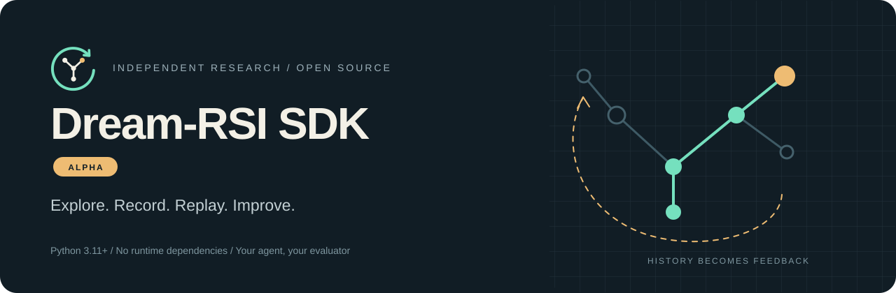
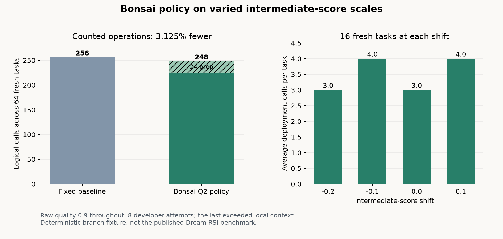
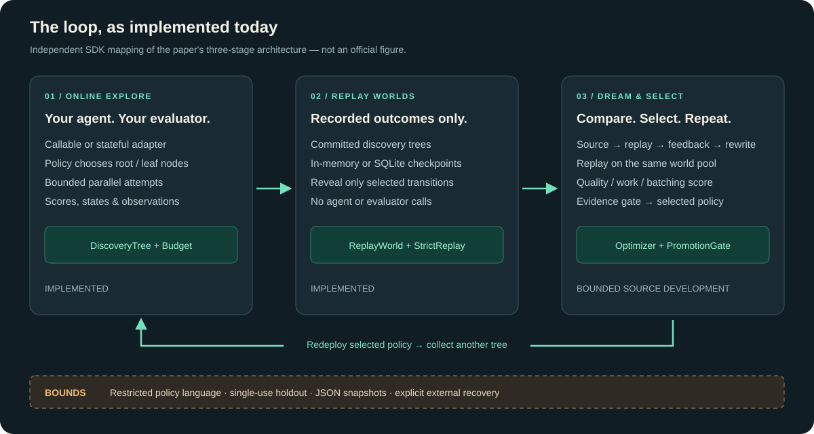
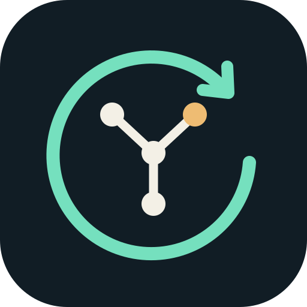

<p align="center">
  
</p>

<p align="center">
  <a href="https://github.com/TheAstrayDev/dream-rsi-sdk/actions/workflows/ci.yml"></a>
  
  
  
  <a href="LICENSE"></a>
</p>

<p align="center"><strong>Bring your agent. Record its search. Replay alternative exploration strategies.</strong></p>
<p align="center">
  <a href="#quickstart">Quickstart</a> ·
  <a href="#architecture">How it works</a> ·
  <a href="#comparison">Research comparison</a> ·
  <a href="#roadmap">Roadmap</a> ·
  <a href="docs/integration.md">Integration guide</a>
</p>

> [!IMPORTANT]
> **An independent, unofficial project. Not a Google product.**
>
> I am [TheAstrayDev](https://github.com/TheAstrayDev), an independent developer.
> I am not an employee of Google or Google DeepMind. This repository is my personal
> research initiative, **not a commercial development by Google**, an official SDK,
> or a project sponsored or endorsed by Google or the research authors.
>
> I have attempted to build a Dream-RSI SDK from publicly available information:
> the paper, project website, and authors' materials. I plan to keep improving it,
> testing it in practice, and closing the gap between this implementation and the research.

## What is this?

**Dream-RSI SDK** is a small Python orchestration layer for exploring candidate solutions
and comparing exploration policies on recorded experience. You supply the agent and evaluator;
the SDK handles attempts, discovery trees, historical replay, and policy selection.

It is designed for developers who already have a **generate → evaluate → refine** loop
and want to experiment with how their search branches, batches work, and stops.
The core has no dependency on a model provider or agent framework.

**Alpha means a working foundation, not a complete reproduction of the paper.**
The default optimizer searches built-in parameters. `LLMPolicyDeveloper` can instead
revise executable policy source through your model client and measured replay feedback.
Its lightweight interpreter needs no Docker and supports a restricted SDK language.

| At a glance | Current state |
| :--- | :--- |
| Runtime | Python 3.11+ · zero required third-party dependencies |
| Integration | Sync/async callables · stateful function adapter · full agent protocol |
| Validation | Regression tests · Ruff · Pyright · wheel build and installation |
| Version | `0.2.0a1` · APIs may change |
| Distribution | [PyPI](https://pypi.org/project/dreamrsi/) · source · GitHub installation |
| Benchmark status | Real local LLM policy development verified on controlled tasks; no proven all-in win with an LLM discovery agent |

**Try it without an API key:** run the [replay lab](examples/02_replay_lab.py) to record a toy
search and compare three policies. It reports whether replay caused any additional agent
or evaluator calls. This is an executable mechanics demo, not an LLM performance benchmark.

## What the experiments actually showed

The two results below test different things. In the Bonsai experiment, a real
local model **wrote policy code**, while a deterministic Python fixture supplied
task solutions. In the GPT-6 Luna experiment, the model **both solved the tasks
and developed policies**. Their call counts must not be pooled or compared as
if they measured the same resource.

### Bonsai Q2: code generation and reuse on a controlled fixture

`Ternary-Bonsai-27B-Q2_g64` ran locally through llama.cpp. The experiment fixed
two training tasks, two separate validation tasks, and 64 fresh tasks before
policy generation. The SDK recorded the training trees, asked Bonsai to revise
an executable policy from replay feedback, sandboxed the code, checked it on
the held-out trees, and reused the accepted source on the fresh tasks. The
accepted source was the **sixth model response**; the full record charges
**eight developer request attempts**, including one rejected for context size.

| Across 64 fresh tasks | Fixed policy | Bonsai-written policy path |
| :--- | ---: | ---: |
| Preparation, including training, developer and validation | 0 | 24 logical operations |
| Fresh-task deployment | 256 | 224 logical operations |
| **Full path** | **256** | **248** |
| Raw quality on every fresh task | 0.9 | 0.9 |



This is a **3.125% reduction in the fixture's counted-operation proxy**, with
preparation included. The eight developer requests were real local model calls;
the discovery-agent operations were scripted, not LLM requests. The result
demonstrates policy writing, replay-guided revision, validation and reuse. It
does not establish a token, dollar or time saving for an LLM discovery agent.
The policy still uses fixed score thresholds and was tested on a narrow branch
family. See the [frozen protocol and audit](docs/experiments/ternary-bonsai-diverse-2026-09-24.md).

### GPT-6 Luna xhigh: real model agent, costly preparation

In a separate exploratory v1 run, `gpt-6-luna` with `xhigh` reasoning and the
Fast tier supplied **both** candidate answers and policy-code revisions. The
run covered low autocorrelation, circle packing and Lasso tuning, with two
held-out tasks per category. The SDK accepted a policy in each category. On
those six tasks, deployment needed **one model answer per task**: **two per
category**, compared with eight baseline answers per category.

| Category, two test tasks each | Baseline calls | Dream-RSI deployment calls | Mean reported score, baseline → Dream-RSI |
| :--- | ---: | ---: | ---: |
| Low autocorrelation | 8 | **2** | 33.333% → 33.333% |
| Circle packing | 8 | **2** | 85.496% → 85.496% |
| Lasso tuning | 8 | **2** | 98.992% → 98.050% |
| **Six-task total / mean** | **24** | **6** | **72.607% → 72.293%** |


The shorter deployments came after **70 training/validation requests and 24
policy-development requests**. The complete Dream-RSI path therefore cost
**94 + 6 = 100 model requests**, versus **24** for baseline. Reported mean
quality was **0.314 percentage points lower**, mainly on Lasso, whose v1 score
also includes a solver-update penalty. This is evidence that executable
policies were learned and reused, **not an all-in economic or quality win**.
The retained run contains eight developer requests per category; the final
selected sources first appear at history entries 2, 1 and 3 respectively.
These counts describe this selected run, not a first-try success rate across
all exploratory attempts. See the [protocol and sanitized data summary](docs/experiments/luna-xhigh-discovery-v1.md).

Replay itself makes no new model requests. The SDK changes the exploration
policy, not model weights. Neither experiment reproduces the published
Dream-RSI benchmarks, and neither demonstrates generalization to arbitrary
agents or task families.

## What's new in 0.2.0a1

This alpha introduces persistent policy reuse through `AdaptivePolicyMemory`,
improves replay cost accounting at the recorded-tree boundary, and gives the
source developer clearer feedback about decisions that do not save live calls.
It also publishes the two experiment records above with preparation costs
shown explicitly. The `0.2` line marks a broader experimental SDK surface,
**not** a proven all-in win on an LLM discovery agent.

### Earlier 0.1.0a4 changes

Recorded runs can now feed an offline policy-improvement pass without a new training run.
Validation worlds are collected only after a candidate improves training replay; the
default promotion gate compares raw quality and probe count separately. A combined
agent/developer call cap and early revision stops reduce avoidable work. These changes
have **not yet proven an end-to-end cost win with an LLM discovery agent**.

The default gate now requires paired quality/probe evidence. If you relied on
score-only promotion, pass `ReplayOnlyGate` explicitly. Built-in policy variants run
before the LLM developer; set `DefaultMethod(force_developer=True)` when source
development must run even after a cheap candidate qualifies.
For offline improvement with strict replay, the SDK also checks the recorded
tree before paying for source generation. If even an optimistic path cannot
improve raw quality or reduce probes, it skips the developer. This is an
impossibility check on recorded outcomes, not a prediction of unseen tasks.

## What's new in 0.1.0a3

That release added the Appendix B grid workflow, bounded source reloads with
SQLite manifests, and replay-capacity accounting. The current published alpha
is listed above.

<a id="quickstart"></a>
## Install and try

You need **Python 3.11+**. Install the published alpha in your virtual environment:

```bash
python -m pip install dreamrsi==0.2.0a1
```

To run the repository examples or contribute, install from source with Git:

```bash
git clone https://github.com/TheAstrayDev/dream-rsi-sdk.git
cd dream-rsi-sdk
python -m venv .venv
```

```bash
# Linux / macOS
source .venv/bin/activate
```

```powershell
# Windows PowerShell
.venv\Scripts\Activate.ps1
```

```bash
python -m pip install -e .
python examples/02_replay_lab.py
```

The demo prints a table of recorded best scores, probes, and decision rounds, followed by
`Additional agent calls during replay: 0` and `Additional evaluator calls during replay: 0`.
No model account or API key is needed. These are SDK call counts, not dollar savings.

For the full online/replay loop, run:

```bash
python examples/01_toy_optimization.py
```

The published experiment records above describe the controlled
[Bonsai Q2 policy-development run](docs/experiments/ternary-bonsai-diverse-2026-09-24.md)
and the [GPT-6 Luna model-agent run](docs/experiments/luna-xhigh-discovery-v1.md).
Both include their preparation costs and limitations. No benchmark service or model
credentials are needed for the two repository examples above.

You can also install directly from GitHub:

```bash
python -m pip install "git+https://github.com/TheAstrayDev/dream-rsi-sdk.git@main"
```

This installs the current `main` branch. Replace `main` with a commit SHA to pin your
installation. The package and import name are **`dreamrsi`**.

## Start with two functions

```python
from dreamrsi import Budget, DreamRSI

def agent(task):
    # Replace this with your existing model or agent call.
    return task.upper()

def evaluate(answer):
    return float(len(answer))

rsi = DreamRSI(agent=agent, evaluator=evaluate, budget=Budget(model_calls=4))
result = rsi.run_sync("hello")

print(result.best)                 # HELLO
print(result.best_score)           # 5.0
print(result.costs.model_calls)    # 4
```

This demonstrates the interface, not a quality improvement: the deterministic agent
returns the same answer each time. In simple callable mode, every attempt receives
**the original task**. Use a stateful adapter to refine a previous result.

## Refine a candidate

```python
from dreamrsi import Budget, DreamRSI, FunctionalAgentAdapter
from dreamrsi.policies import DepthFirstPolicy

def refine(state, context):
    return {"x": state["x"] * 0.5}

rsi = DreamRSI(
    adapter=FunctionalAgentAdapter(refine),
    evaluator=lambda candidate: -(candidate["x"] ** 2),
    policy=DepthFirstPolicy(),
    budget=Budget(model_calls=6),
)

result = rsi.run_sync({"x": 8.0})
print(result.best)        # {'x': 0.125}
print(result.best_score)  # -0.015625
```

Each output becomes the next state in its branch. **Higher scores are always better**;
this example uses `-x²` to express a minimization objective.

## Run the improvement loop

```python
import asyncio
from dreamrsi import Budget, DreamRSI, FunctionalAgentAdapter

async def main():
    rsi = DreamRSI(
        adapter=FunctionalAgentAdapter(lambda state: {"x": state["x"] * 0.5}),
        evaluator=lambda candidate: -(candidate["x"] ** 2),
        budget=Budget(model_calls=20, max_parallelism=4, max_depth=8),
    )
    result = await rsi.improve({"x": 8.0}, rounds=3)
    print("Best:", result.best)
    print("Worlds:", len(result.worlds))
    print("Promotions:", result.metrics["policy_promotions"])

asyncio.run(main())
```

The budget applies to **each online run**: this example permits up to 60 `propose` calls
across three runs. No promotion is a valid outcome. Inside an existing event loop,
use `await rsi.run(...)` or `await rsi.improve(...)` directly instead of the sync wrappers.

When you already have a completed run, `await rsi.record_world(task, run_result)`
adds its tree to replay. Constructing the runtime with `DefaultMethod(online=False)`
then makes `await rsi.improve(task, rounds=1)` perform one offline improvement pass
without a fresh training run. The original run's acquisition calls still belong in
the full campaign cost.

### Reuse a policy on related tasks

`AdaptivePolicyMemory` stores policy versions in SQLite and creates a
fresh runtime for each task. The deterministic `family_of` function decides
whether a saved policy applies. After a normal run, `raw_quality` is compared
with a task-specific floor; only a missing or degraded policy triggers one
offline improvement pass. If no challenger passes promotion, a successful
incumbent is still saved for reuse. It is marked `incumbent`, **not** as a
holdout-validated promotion. Normal-run trees are saved by family and reused
for later offline replay. No campaign checkpoint is restored.

```python
from dreamrsi import (
    AdaptivePolicyMemory, Budget, DefaultMethod, DreamRSI,
    HoldoutPipeline, PolicyMemorySettings, SQLiteStore,
)
from dreamrsi.policies import BalancedPolicy

def build_runtime(task, saved_policy):
    return DreamRSI(
        adapter=my_agent_adapter,
        evaluator=my_evaluator,
        policy=saved_policy or BalancedPolicy(batch_size=1),
        policy_optimizer=my_policy_developer,
        validation=HoldoutPipeline([fresh_independent_holdout(task)]),
        budget=Budget(model_calls=2, max_nodes=3, max_depth=2),
        method=DefaultMethod(online=False),
    )

memory = AdaptivePolicyMemory(
    store=SQLiteStore("policy-memory.sqlite3"),
    runtime_factory=build_runtime,
    family_of=lambda task: task["kind"],
    raw_quality=lambda task, run: run.best_score,
    minimum_quality=lambda task: quality_floors[task["kind"]],
    settings=PolicyMemorySettings(
        save_worlds=True,
        reuse_worlds=True,
        save_policies=True,
        reuse_policies=True,
        accept_world=lambda current, recorded, world: (
            current["kind"] == recorded["kind"] and world.tree.size >= 2
        ),
        accept_policy=lambda task, policy, origin, saved_quality: (
            origin == "promoted"
            or (saved_quality is not None
                and saved_quality >= quality_floors[task["kind"]])
        ),
    ),
)
outcome = await memory.run(task)
print(outcome.reused_policy, outcome.trained, outcome.promoted, outcome.incumbent_saved)
```

Choose a family key that includes the task and objective version, and use a
*raw* quality metric rather than a score that already penalizes work. A saved
policy is loaded as a new object; old versions are never overwritten. The
quality check uses the outcome of the ordinary task run, so it adds no model
request by itself. A saved incumbent has not passed an independent holdout;
each new task is checked against its quality floor. A new or degraded family may
still need developer and fresh
holdout requests; inspect `outcome.result` and `outcome.improvement` for the full
cost. Supply a new, independent holdout for each improvement attempt; the memory
reserves its task IDs so an earlier holdout cannot be silently reused. For an
already validated champion, call `await memory.remember(task, champion,
origin="promoted")` once.
The four `PolicyMemorySettings` switches control storage and reuse **across
tasks** independently; the current run can still use its own accepted tree for
offline improvement. `accept_world`
receives the current task, the tree's original task and its `ReplayWorld`;
`accept_policy` receives the task, policy, origin and saved raw quality. Both
rules can be async. A rejected historical artifact remains on disk but is not
reused; a rejected new tree is excluded from replay and storage. Omit either
rule to accept everything. Pass `task=` to `memory.load(family, task=task)` to
apply the policy rule to an explicit load.
Keep acceptance rules deterministic and local when measuring model costs;
external calls made inside them need their own accounting.
There is no universal algorithm that recognizes the meaning of arbitrary text:
the application must provide `family_of` and a comparable raw-quality floor.

<a id="architecture"></a>
## How it works

Dream-RSI turns previous discovery runs into replay environments for exploration policies.
The agent and evaluator stay fixed while the search strategy changes.
See the [authors' method overview](https://dream-rsi.com/#method).

<p align="center">
  
</p>

*An original SDK diagram mapped to Figure 1 and section 3 of the
[Dream-RSI paper](https://arxiv.org/html/2609.14858v1#S3), not an official Google figure.
Green denotes implemented components; the lower row records execution and recovery boundaries.*

1. **Online explore:** select root or leaf nodes, run bounded parallel attempts, evaluate
   their results, and record states and observations in a `DiscoveryTree`.
2. **Replay worlds:** commit the tree and wrap it as a `ReplayWorld`. Replaying policies
   uses recorded transitions without calling the discovery agent or evaluator.
3. **Dream and select:** compare the incumbent and candidate policies on the same world
   pool. An evidence gate selects a policy for the next online run.

Replay cannot predict outcomes outside the recorded tree. Improvement on fixed historical
replay scores does not guarantee improvement on the next real run.

## Fit it into your architecture

| Integration level | Interface | Use case |
| :--- | :--- | :--- |
| Minimal | `agent(task)` + `evaluator(candidate)` | Independent attempts with an existing model API |
| Stateful | `FunctionalAgentAdapter(step)` | Refining an answer, program, parameter set, or plan |
| Full control | `AgentAdapter` | Custom memory, tools, execution, and workspace snapshots |

The full adapter needs no inheritance. Implement five methods:

```text
initial_state(task)
    └─ propose(state, context)
          └─ execute(proposal, state, context)
                └─ observe(execution, state)
                      ├─ evaluator(observation, context)
                      └─ next_state(observation, state)
```

Methods may be sync or async. Keep model clients **inside the adapter** and state in
copyable snapshots. Your adapter must isolate external files and processes between branches.

[Read the integration guide: state, context, budgets, cancellation, and export →](docs/integration.md)

| Extension point | Responsibility | Included implementations |
| :--- | :--- | :--- |
| Agent | Generate and execute candidates | CallableAgentAdapter, FunctionalAgentAdapter |
| Evaluator | Score results | Callable, Numeric, Composite |
| ExplorationPolicy | Choose branches | Balanced, Greedy, BreadthFirst, DepthFirst, Random, EpsilonGreedy, FixedParallel |
| PolicyOptimizer | Propose strategies | DeterministicPolicyOptimizer, ParameterSearchOptimizer |
| Policy development | Write and revise executable source | LLMPolicyDeveloper, SourcePolicy, PolicySandbox |
| PromotionGate | Decide whether to adopt | ReplayOnlyGate, HoldoutGate, CompositeGate |
| Store | Save runs and evidence | InMemoryStore, SQLiteStore |

<a id="comparison"></a>
## Replace the orchestration pieces

`DreamRSI(..., replay=my_engine, objective=my_objective, method=my_method)`
accepts independent components. Defaults retain strict recorded-tree replay and the
paper-inspired phase order. A custom objective changes policy ranking everywhere,
including promotion; it does not replace the fixed task evaluator.

See [extension contracts](docs/integration.md#replaceable-replay-objective-and-method)
and the [architecture hardening tracker](docs/hardening.md). Source development, a bounded interpreter, validation and durable checkpoints are
available in the SDK. See the [research-loop guide](docs/research-loop.md).

The [Appendix B mode](docs/appendix-b.md), included in PyPI 0.1.0a3, adds `OptimalPolicy.solve()`,
observation helpers, pre-cycle `plan_grid()`, persisted earlier-live history and beta
sweeps. `AppendixPolicyDeveloper` rewrites complete class source against those sweeps.
Its AUC normalization is explicitly SDK-versioned; unpublished numerical details are
not claimed as exact research-code parity.


## Original research vs. this SDK

Based on [section 3](https://arxiv.org/html/2609.14858v1#S3),
[appendix B.2](https://arxiv.org/html/2609.14858v1#A2.SS2), and the
[project website](https://dream-rsi.com/). This compares the **published method with this
SDK's code**, not compatibility with an official implementation. On September 20, 2026,
the [official repository](https://github.com/zhengkid/Dream-RSI) stated that code was being prepared for release.

**✓ Implemented** · **◐ Partial** · **○ Planned**

| Research component | SDK | Implementation or difference |
| :--- | :---: | :--- |
| Fixed discovery agent and evaluator | ✓ | Separate integrations; model weights are not updated |
| Discovery trees with states and outcomes | ✓ | Python snapshots; external workspace isolation belongs to the adapter |
| Root/leaf selection and batched work | ✓ | Shared action validation and concurrent online execution |
| Replay of recorded transitions | ✓ | StrictReplay; unrevealed outcomes stay hidden |
| Growing historical world pool | ✓ | SQLite checkpoints and restart recovery; uncertain external calls require reconciliation |
| Decisions based on revealed observations | ✓ | Shared prefix-only observations, diagnostics and history |
| Quality/work/parallelism objective | ✓ | Section 3 β₁/β₂; separate Appendix B beta sweep with documented SDK AUC conventions |
| Appendix B solve, helpers and grid planning | ✓ | Separate grid runtime with bounded class-source execution and prior-live planning snapshots |
| LLM-driven iterative policy-code revision | ◐ | Executable source revision and error repair verified with local Bonsai; restricted language, toy evidence rather than research benchmarks |
| Incumbent comparison and online redeployment | ✓ | Improve loop and evidence gate on a shared world pool |
| Algorithm, math, and GPU experiments | ○ | Toy demos and SDK tests; published results have not been reproduced |

`HoldoutPipeline` collects separate worlds and consumes each validation batch once.
`PolicySandbox` interprets a bounded policy language without Docker or host `exec`.
Its [configuration guide](docs/sandbox.md) covers resource limits, per-function allowlists,
JSON profiles and an optional interruptible worker process.
These are SDK implementations, not reproductions of every research execution detail.

## Alpha limitations

- **No universal speedup claim.** A compatible interface is not evidence of effectiveness
  on every AI architecture. Meaningful evaluation and controlled experiments are essential.
- **Restricted generated-policy language.** Helpers, bounded collections and a math proxy
  are supported; arbitrary Python, host imports and external tools are unavailable.
- **Reported costs.** USD/token limits require explicit ceilings; nested API usage requires
  adapter reporting. Unknown usage is conservatively estimated.
- **Recovery boundaries.** SQLite restores saved phases; uncertain external work must be
  reconciled before skipping an interrupted round. State must be JSON-compatible.
- **Service-specific cancellation.** Adapters confirm remote termination; a cancelled wait
  alone cannot stop a thread or a remote job.
- **Experimental evidence.** A local model produced and revised useful policy code.
  The varied-score fixture saved eight all-in calls across 64 fresh seeds at equal quality,
  but those seeds encode only two branch-order patterns. Broad multi-task generalization,
  real discovery-agent economics and the original benchmarks remain unverified.

<a id="roadmap"></a>
## Roadmap

These are priorities, not promised release dates. Progress means working code and
reproducible checks rather than a growing list of framework names.

| Phase | Deliverable | Completion criterion |
| :--- | :--- | :--- |
| **01 · Foundation** ✓ | Adapters, trees, replay, policies, budgets, tests | Executable examples and contract checks |
| **02 · Observable policies** ✓ | Revealed observations, diagnostics, historical context | Tests exclude future-information leakage |
| **03 · Reliable campaigns** ◐ | Persistent storage, resume, campaign-wide limits | Resume after a restart without losing history |
| **04 · Evidence before promotion** ✓ | Independent validation worlds and reports | Separate train/validation evidence and reproducible decisions |
| **05 · Dreaming with code** ◐ | LLM policy developer and bounded execution | Behavioral revision, stopping repair, promotion and reload verified on a toy task; broaden evaluation |
| **06 · Real integrations** ◐ | Real-agent examples and provider cost accounting | Public comparisons under equal, documented budgets |
| **07 · Stable SDK** ○ | Stable APIs, versioned data, package publication | Compatibility checks and migration guidance |

See [ARCHITECTURE.md](ARCHITECTURE.md) for the technical audit and implementation priorities.

## Help shape the next iteration

Already building a generate/evaluate loop? Try one task with your own adapter and
[tell me what blocked you](https://github.com/TheAstrayDev/dream-rsi-sdk/issues/new?template=early_adopter.yml).
Useful feedback includes the interface you needed, your scoring method, and a minimal
reproduction. Positive results, failures, and "this does not fit my workflow" are all useful.

For fixes and larger changes, see [CONTRIBUTING.md](CONTRIBUTING.md).

## Development

```bash
python -m pip install -e ".[dev]"
python -m pytest -q
python -m ruff check src tests examples
python -m pyright
```

```bash
python -m pip install build
python -m build
```

The initial public commit passed CI on Python 3.11–3.14 on Linux and 3.14 on Windows.
See [Actions](https://github.com/TheAstrayDev/dream-rsi-sdk/actions) for the current commit's
status. Tests need no paid APIs or model credentials.

```text
src/dreamrsi/
├── adapters.py     # existing-agent integration
├── runtime.py      # online exploration and shared operations
├── methods.py      # replaceable outer improvement loop
├── discovery/      # attempt trees and snapshots
├── replay/         # recorded-history replay
├── policies/       # seven built-in strategies
├── optimization/   # candidate policies and version management
├── promotion/      # evidence-based adoption decisions
├── evaluation/     # scoring and composition
├── storage/        # in-memory and SQLite storage
├── events/         # events and callbacks
├── models/         # shared data types
└── protocols/      # extension contracts
```

## Research credit and project ownership

The research is by **Tong Zheng and coauthors**, affiliated with Google, Google DeepMind,
the University of Maryland, and the University of Virginia. Original materials:

- [Dream-RSI: Recursive Self-Improvement through Evolving Worlds — arXiv:2609.14858](https://arxiv.org/abs/2609.14858)
- [Official project website](https://dream-rsi.com/)
- [Official research repository](https://github.com/zhengkid/Dream-RSI)

This independent SDK is maintained by **[TheAstrayDev](https://github.com/TheAstrayDev)**.
Please distinguish research citations from references to this implementation.
The logo and architecture illustration are original SDK assets, not Google branding.

Licensed under [Apache License 2.0](LICENSE). See [NOTICE](NOTICE) for attribution and
non-affiliation. The personal nature of this initiative does not change the license terms.

---

<p align="center"><br><sub>Built independently. Grounded in recorded experience. Still evolving.</sub></p>
