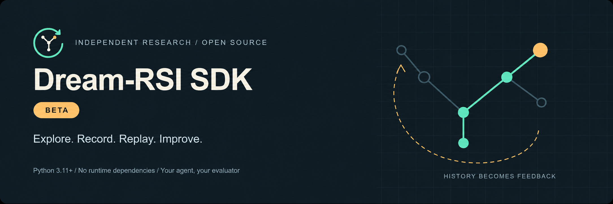
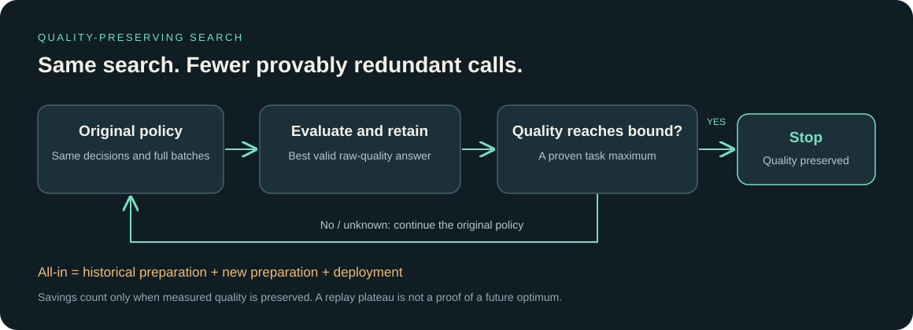
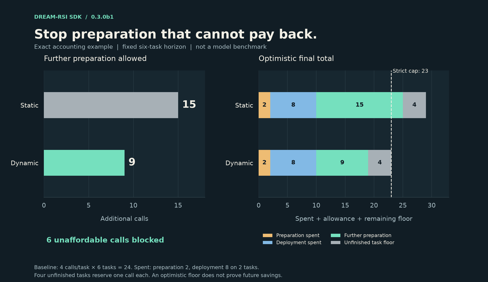
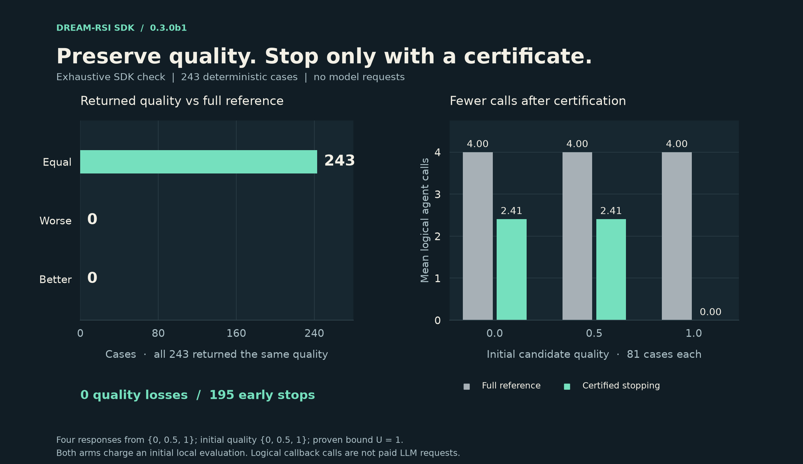
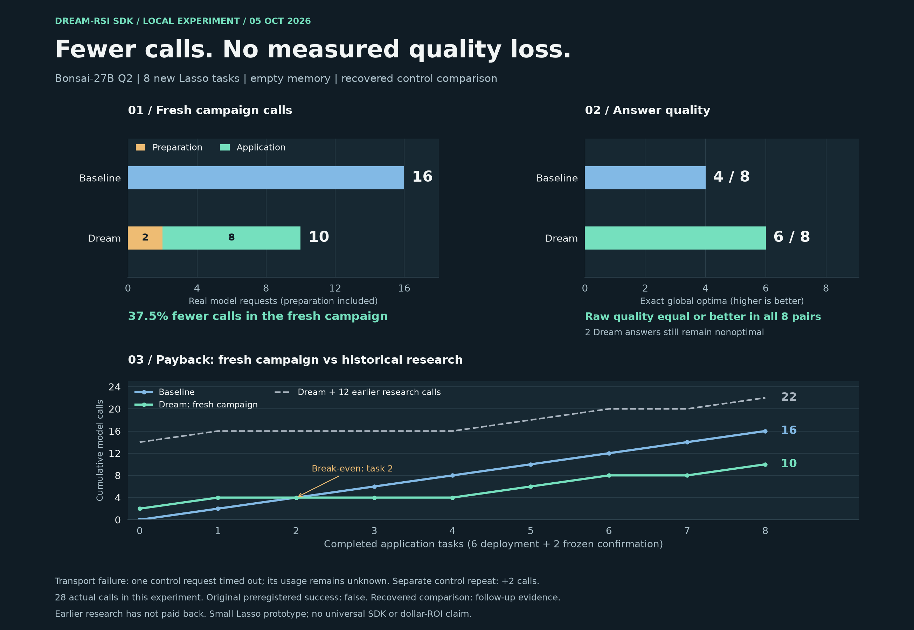
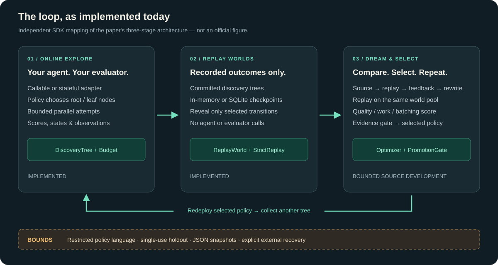
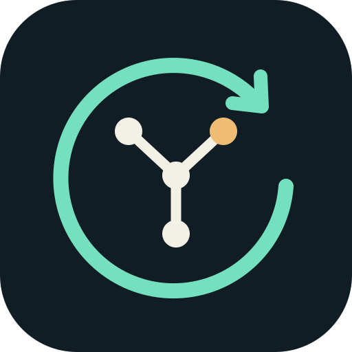

<p align="center">
  
</p>

<p align="center">
  <a href="https://github.com/TheAstrayDev/dream-rsi-sdk/actions/workflows/ci.yml"></a>
  
  
  
  <a href="LICENSE"></a>
</p>

<p align="center"><strong>Bring your agent. Preserve verified quality. Account for every model request.</strong></p>
<p align="center">
  <a href="#quickstart">Quickstart</a> ·
  <a href="#architecture">How it works</a> ·
  <a href="#package-cli">Package sharing</a> ·
  <a href="#latest-real-model-result">Latest local result</a> ·
  <a href="#comparison">Research comparison</a> ·
  <a href="#roadmap">Roadmap</a> ·
  <a href="docs/integration.md">Integration guide</a>
</p>

> [!IMPORTANT]
> **An independent, unofficial project. Not a Google product.**
>
> I am [TheAstrayDev](https://github.com/TheAstrayDev), an independent developer.
> I am not an employee of Google or Google DeepMind. This repository is my personal
> research initiative, **not a commercial development by Google**, an official SDK,
> or a project sponsored or endorsed by Google or the research authors.
>
> I have attempted to build a Dream-RSI SDK from publicly available information:
> the paper, project website, and authors' materials. I plan to keep improving it,
> testing it in practice, and closing the gap between this implementation and the research.

## What is this?

**Dream-RSI SDK** is a small Python orchestration layer for exploring candidate solutions
and comparing exploration policies on recorded experience. You supply the agent and evaluator;
the SDK handles attempts, discovery trees, historical replay, and policy selection.

It is designed for developers who already have a **generate → evaluate → refine** loop
and want to experiment with how their search branches, batches work, and stops.
The core has no dependency on a model provider or agent framework.

**Version 0.3.0b1 adds opt-in quality protection and complete call accounting.**
With a `QualityContract`, the strict mode preserves the original search and stops
only after attaining a mathematically sound quality bound. Without that contract,
the default optimizer derives shorter prefixes of the incumbent policy from
recorded replay, alongside a bounded portfolio of built-in branching and stopping
policies. Synthesis makes no model requests; candidates still require validation.
`LLMPolicyDeveloper` can instead
revise executable policy source through your model client and measured replay feedback.
Its lightweight interpreter needs no Docker and supports a restricted SDK language.
Beta is an SDK maturity milestone, not a complete reproduction of the paper or
evidence of a universal speedup.

| At a glance | Current state |
| :--- | :--- |
| Runtime | Python 3.11+ · zero required third-party dependencies |
| Integration | Sync/async callables · stateful function adapter · full agent protocol |
| Validation | Regression tests · Ruff · Pyright · wheel build and installation |
| Version | `0.3.0b1` · Beta prerelease |
| Distribution | [PyPI](https://pypi.org/project/dreamrsi/0.3.0b1/) · install the Beta with `--pre` |
| Benchmark status | Narrow Bonsai Q2 Lasso follow-up: 37.5% fewer fresh-campaign calls with paired quality preserved after control recovery; broader economics unverified |

**Try it without an API key:** run the [replay lab](examples/02_replay_lab.py) to record a toy
search and compare three policies. It reports whether replay caused any additional agent
or evaluator calls. This is an executable mechanics demo, not an LLM performance benchmark.

## What's new 0.3.0b1

- **Quality contracts:** preserve the original search and select the best valid raw-quality answer; stop only at a sound attained bound.
- **All-in budgets:** dynamic preparation limits include historical spending, actual deployment, reported nested calls and failed requests.
- **Sandbox profiles:** Docker-free presets, JSON settings and a bounded validated-code cache with fresh execution state.
- **Reliable reuse:** atomic holdout reservations, isolated callback inputs and restored sandbox profiles.
- **Beta compatibility:** public `PolicyDeveloper`, schema guards, legacy loaders and installed-wheel CLI/process checks.



**Quality and cost are separate constraints.** A recorded plateau can miss a later
improvement. The new strict mode retains the original policy's decisions and complete
batches, selects the answer with the best valid **raw quality**, and stops only when
that quality exactly reaches a proven task maximum. Unknown bounds continue the
original search. Learned fixed caps cannot silently replace it.

```python
from dreamrsi import Budget, DreamRSI, EconomyPlan, QualityContract

rsi = DreamRSI(
    agent=my_agent,
    evaluator=my_evaluator,          # Score is raw quality in this example.
    policy=my_baseline_policy,
    budget=Budget(model_calls=4),
    quality=QualityContract(id="exact-task-quality-v1", upper_bound=1.0),
    economy=EconomyPlan(baseline_calls_per_task=4, horizon=6),
)
result = await rsi.run(task)
print(result.metrics["raw_quality"])
```

Supply your application's agent, evaluator and original policy. **Use `1.0` only
when it is a proven upper bound for every feasible answer**, not the highest score
seen in training. Custom raw-quality extractors and locally computed task bounds
are supported. Strict protection needs no policy-development calls. An optional
initial candidate is evaluated, retained and charged normally.

For a full-search comparison, use the same contract with `certified_stopping=False`.
This keeps the same quality metadata and initial evaluation in both arms. The
no-loss argument compares the same response trajectory under matching limits;
independent stochastic runs and differing wall-time cutoffs need empirical checks.

The exact conditions are `q(best) = U` for stopping and
`preparation < Σ(baseline_calls − deployment_calls)` for strict all-in savings.
`EconomyPlan` recalculates the remaining preparation allowance before every request:

```text
remaining = max(0, H*B - 1 - historical - preparation - deployment - max(0, H-done)*m)
```

Here `H` is the fixed task horizon, `B` the baseline calls per task, and `m` the
declared minimum calls per unfinished task. Actual spending replaces optimistic
estimates as tasks finish. For a six-task, four-call baseline, two preparation
calls and eight deployment calls across two tasks leave **9** additional
preparation calls, rather than the old static allowance of 15. This prevents six
unaffordable requests; it is not a measured six-call improvement in model quality.



The ledger separately counts preparation and deployment,
including reported nested provider calls, failed requests and retries. Unknown
token or dollar costs remain unknown. Full search may exceed an optimistic savings
target; the SDK does not sacrifice quality to make that target appear successful.

Set `preserve_policy=False` on the quality contract to allow experimental policy
rewrites with replay and holdout checks. Those checks supply empirical evidence,
not a universal guarantee. Applications without a quality contract keep their
existing policy-development behavior.

**Configure the sandbox in one line**, without Docker:

```python
from dreamrsi import PolicySandbox, SandboxConfig

sandbox = PolicySandbox.from_preset("large", max_steps=2_000_000)
SandboxConfig.preset("large").save("sandbox.json")
sandbox = PolicySandbox.from_file("sandbox.json")
```

Every preset keeps all supported language features. A bounded cache reuses validated
code, while observations, execution state and limits remain fresh. A local paired
test measured **2.90x** faster decisions with one frontier node and **1.41x** with
eight. These are interpreter timings, not LLM call savings. Profiles, overrides,
cache controls and the killable process backend are described in the
[sandbox guide](docs/sandbox.md).


**The quality invariant was also checked through the actual SDK runtime.** All
243 finite deterministic cases returned the same raw quality as a full reference;
195 stopped before the fourth agent call. Both arms charged the same initial local
evaluation. These logical callback counts are engineering checks, not paid model
measurements or a new all-in LLM result.



Beta also adds isolated raw-quality callback inputs, atomic holdout reservations
in built-in stores, correct sandbox recovery for wrapped source policies,
explicit artifact-schema rejection, a public `PolicyDeveloper`
protocol, backward-compatibility tests and isolated installed-wheel checks for
the CLI, source codecs and process sandbox. The engineering roadmap is covered
below; research-scale performance remains a separate validation task.

[Quality contract and proof](docs/quality-contract.md) ·
[All-in accounting](docs/all-in.md) ·
[Compatibility](docs/compatibility.md) ·
[Beta release notes](docs/releases/0.3.0b1.md) ·
[Figure data and reproducibility](docs/verification/0.3.0b1.md) ·
[Runnable mechanics demo](examples/17_certified_quality.py)

## What the experiments actually showed

The latest record below uses real local model answers and an isolated structural-transfer prototype. It separates fresh-campaign savings, control recovery and historical expenses.

<a id="latest-real-model-result"></a>
### Latest local follow-up: Bonsai Q2 structural dreams

On **October 5, 2026**, local `Ternary-Bonsai-27B-Q2_g64` through llama.cpp ran
one new preparation task and eight new **two-feature Lasso** application tasks.
The campaign started with empty memory; previous trees and champions were
inaccessible to the runner. Six application tasks could develop memory, followed
by two tasks using physically saved, reloaded and frozen memory.



| Recovered matched comparison, eight application tasks | Baseline | Experimental Dream path |
| :--- | ---: | ---: |
| Preparation model calls | 0 | 2 |
| Application model calls | 16 | 8 |
| **Fresh-campaign total** | **16** | **10** |
| Matched input + output tokens | 36,960 | 23,102 |
| Exact global optima | 4/8 | **6/8** |
| Paired raw quality | Reference | Equal or better on all 8 tasks |

The fresh campaign used **37.5% fewer calls**, with preparation included. Four
application tasks required zero LLM calls. Their answers came from a locally
solved active-support/sign pattern extracted from this campaign's own recorded
answers, accepted only after exact rational KKT checks. Incompatible patterns
triggered the original two-call model policy. The model generated the preparation
and fallback answers; local transfer did not update model weights or ask the
model to write executable policy code.

**This is follow-up evidence after a transport failure.** One baseline request
timed out at 90 seconds. Remaining requests used a documented 300-second limit,
and the affected baseline task was checked separately with two additional calls.
The original report was retained and its preregistered success flag remains false.
The complete experiment consumed **28 actual calls: 10 Dream, 16 primary control
and 2 separate control-repeat calls**. The matched comparison uses the completed
repeat for that one task; the two originally affected control calls remain
charged as overhead. Their full token usage is unknown, as is dollar ROI.

**Historical research is still an expense.** Adding 12 earlier pilot/settings
calls gives 22 Dream-side calls against this series's 16-call matched baseline.
Those earlier costs have not yet paid back. Fresh-campaign costs tie after the
second application task and become lower after the third.

The structural transfer module is an **isolated experimental prototype using the
SDK's quality hooks**, not a feature shipped in the installed package. Two Dream
answers remain nonoptimal. A conventional exact solver can also solve these small
Lasso tasks without an LLM; this comparison does not establish an advantage over
that solver, an overall multi-category win, or readiness for a general Beta release.
See the [conditions, exact errors and curated figure data](docs/verification/bonsai-structural-dream-2026-10-05.md).

Earlier policy-code and discovery experiments remain documented separately: [Bonsai Q2 fixture](docs/experiments/ternary-bonsai-diverse-2026-09-24.md) and [GPT-6 Luna discovery](docs/experiments/luna-xhigh-discovery-v1.md). For previous version changes, see [CHANGELOG.md](CHANGELOG.md).

<a id="quickstart"></a>
## Install and try

You need **Python 3.11+**. Install the Beta prerelease:

```bash
python -m pip install --pre --upgrade dreamrsi==0.3.0b1
```

To run the repository examples from a source checkout:

```bash
python -m pip install -e .
python examples/17_certified_quality.py
```

The demo uses a deterministic agent to check mechanics; it is not a model benchmark.

The same package includes the Python API and `dreamrsi` command. GitHub CLI (`gh`)
is an additional requirement only when publishing a policy package to GitHub.

To run the repository examples or contribute, install from source with Git:

```bash
git clone https://github.com/TheAstrayDev/dream-rsi-sdk.git
cd dream-rsi-sdk
python -m venv .venv
```

```bash
# Linux / macOS
source .venv/bin/activate
```

```powershell
# Windows PowerShell
.venv\Scripts\Activate.ps1
```

```bash
python -m pip install -e .
python examples/02_replay_lab.py
```

The demo prints a table of recorded best scores, probes, and decision rounds, followed by
`Additional agent calls during replay: 0` and `Additional evaluator calls during replay: 0`.
No model account or API key is needed. These are SDK call counts, not dollar savings.

For the full online/replay loop, run:

```bash
python examples/01_toy_optimization.py
```

The published experiment records above describe the controlled
[Bonsai Q2 policy-development run](docs/experiments/ternary-bonsai-diverse-2026-09-24.md)
and the [GPT-6 Luna model-agent run](docs/experiments/luna-xhigh-discovery-v1.md).
Both include their preparation costs and limitations. No benchmark service or model
credentials are needed for the two repository examples above.

You can also install directly from GitHub:

```bash
python -m pip install "git+https://github.com/TheAstrayDev/dream-rsi-sdk.git@main"
```

This installs the current `main` branch. Replace `main` with a commit SHA to pin your
installation. The package and import name are **`dreamrsi`**.

## Third-party policies and replay datasets

<a id="package-cli"></a>

Dream-RSI supports community-developed exploration policies and replay datasets:
collections of recorded discovery trees and their task context. Developers can
share one or more task families in a portable bundle and integrate them with their
own agents through `AdaptivePolicyMemory`, explicit policy codecs and configurable
acceptance rules. Model weights and application infrastructure are not bundled.

Public GitHub repositories provide the catalog and storage. The CLI lists packages
by GitHub stars, exports saved memory without model calls, and imports compatible
packages into the recipient's local SQLite store.

```bash
dreamrsi list
dreamrsi install OWNER/REPOSITORY
dreamrsi save exploration-pack --all
dreamrsi publish .dreamrsi/packages/exports/exploration-pack.dreamrsi.json
```

Replace `OWNER/REPOSITORY` with an actual published package. Save expects existing
data in `.dreamrsi/memory.sqlite3`; use `-d PATH -n auto` for another database.
Publishing requires [GitHub CLI](https://cli.github.com/) and makes package data
public. Installation does not automatically change an agent: the application must
use the same database and family key, and pass the loaded policy to its runtime.

Read the [package guide](docs/packages.md), the
[0.2.0a2 integration walkthrough and diagram](docs/releases/0.2.0a2.md), or run
the [complete local transfer example](examples/shared_policy_bundle.py).
Reuse remains subject to the recipient's quality checks; compatibility and savings
are measured properties, not guarantees attached to a package's popularity.

## Start with two functions

```python
from dreamrsi import Budget, DreamRSI

def agent(task):
    # Replace this with your existing model or agent call.
    return task.upper()

def evaluate(answer):
    return float(len(answer))

rsi = DreamRSI(agent=agent, evaluator=evaluate, budget=Budget(model_calls=4))
result = rsi.run_sync("hello")

print(result.best)                 # HELLO
print(result.best_score)           # 5.0
print(result.costs.model_calls)    # 4
```

This demonstrates the interface, not a quality improvement: the deterministic agent
returns the same answer each time. In simple callable mode, every attempt receives
**the original task**. Use a stateful adapter to refine a previous result.

## Refine a candidate

```python
from dreamrsi import Budget, DreamRSI, FunctionalAgentAdapter
from dreamrsi.policies import DepthFirstPolicy

def refine(state, context):
    return {"x": state["x"] * 0.5}

rsi = DreamRSI(
    adapter=FunctionalAgentAdapter(refine),
    evaluator=lambda candidate: -(candidate["x"] ** 2),
    policy=DepthFirstPolicy(),
    budget=Budget(model_calls=6),
)

result = rsi.run_sync({"x": 8.0})
print(result.best)        # {'x': 0.125}
print(result.best_score)  # -0.015625
```

Each output becomes the next state in its branch. **Higher scores are always better**;
this example uses `-x²` to express a minimization objective.

## Run the improvement loop

```python
import asyncio
from dreamrsi import Budget, DreamRSI, FunctionalAgentAdapter

async def main():
    rsi = DreamRSI(
        adapter=FunctionalAgentAdapter(lambda state: {"x": state["x"] * 0.5}),
        evaluator=lambda candidate: -(candidate["x"] ** 2),
        budget=Budget(model_calls=20, max_parallelism=4, max_depth=8),
    )
    result = await rsi.improve({"x": 8.0}, rounds=3)
    print("Best:", result.best)
    print("Worlds:", len(result.worlds))
    print("Promotions:", result.metrics["policy_promotions"])

asyncio.run(main())
```

The budget applies to **each online run**: this example permits up to 60 `propose` calls
across three runs. No promotion is a valid outcome. Inside an existing event loop,
use `await rsi.run(...)` or `await rsi.improve(...)` directly instead of the sync wrappers.

When you already have a completed run, `await rsi.record_world(task, run_result)`
adds its tree to replay. Constructing the runtime with `DefaultMethod(online=False)`
then makes `await rsi.improve(task, rounds=1)` perform one offline improvement pass
without a fresh training run. The original run's acquisition calls still belong in
the full campaign cost.

### Reuse a policy on related tasks

`AdaptivePolicyMemory` stores policy versions in SQLite and creates a
fresh runtime for each task. The deterministic `family_of` function decides
whether a saved policy applies. After a normal run, `raw_quality` is compared
with a task-specific floor; only a missing or degraded policy triggers one
offline improvement pass. If no challenger passes promotion, a successful
incumbent is still saved for reuse. It is marked `incumbent`, **not** as a
holdout-validated promotion. Normal-run trees are saved by family and reused
for later offline replay. No campaign checkpoint is restored.

```python
from dreamrsi import (
    AdaptivePolicyMemory, Budget, DefaultMethod, DreamRSI,
    HoldoutPipeline, PolicyMemorySettings, SQLiteStore,
)
from dreamrsi.policies import BalancedPolicy

def build_runtime(task, saved_policy):
    return DreamRSI(
        adapter=my_agent_adapter,
        evaluator=my_evaluator,
        policy=saved_policy or BalancedPolicy(batch_size=1),
        policy_optimizer=my_policy_developer,
        validation=HoldoutPipeline([fresh_independent_holdout(task)]),
        budget=Budget(model_calls=2, max_nodes=3, max_depth=2),
        method=DefaultMethod(online=False),
    )

memory = AdaptivePolicyMemory(
    store=SQLiteStore("policy-memory.sqlite3"),
    runtime_factory=build_runtime,
    family_of=lambda task: task["kind"],
    raw_quality=lambda task, run: run.best_score,
    minimum_quality=lambda task: quality_floors[task["kind"]],
    settings=PolicyMemorySettings(
        save_worlds=True,
        reuse_worlds=True,
        save_policies=True,
        reuse_policies=True,
        accept_world=lambda current, recorded, world: (
            current["kind"] == recorded["kind"] and world.tree.size >= 2
        ),
        accept_policy=lambda task, policy, origin, saved_quality: (
            origin == "promoted"
            or (saved_quality is not None
                and saved_quality >= quality_floors[task["kind"]])
        ),
    ),
)
outcome = await memory.run(task)
print(outcome.reused_policy, outcome.trained, outcome.promoted, outcome.incumbent_saved)
```

### Share saved policies and replay trees

After the memory has saved a policy and its training worlds, export a single file:

```python
await memory.export_bundle(task, "shared-policy.dreamrsi.json")
```

The recipient creates a compatible `AdaptivePolicyMemory`, then imports and runs:

```python
await other_memory.import_bundle("shared-policy.dreamrsi.json", task=task)
result = await other_memory.run(new_related_task)
print(result.reused_policy, result.trained)
```

The bundle contains saved policy versions, the selected version, and replay trees with
their original task data. Import checks the file checksum, policy source integrity, and
tree structure; it never executes arbitrary serialized Python. A passing policy avoids
policy-development calls, while the recipient's normal agent still solves each new task.
Both sides must use the same task-family key and compatible policy sandbox. Imports do not
replace a different local champion; use a fresh `namespace` to bring in another bundle.
The file can contain prompts, observations, proposals, or other task data, so inspect it
before sharing. JSON-compatible tasks and registered policy codecs are required.

Choose a family key that includes the task and objective version, and use a
*raw* quality metric rather than a score that already penalizes work. A saved
policy is loaded as a new object; old versions are never overwritten. The
quality check uses the outcome of the ordinary task run, so it adds no model
request by itself. A saved incumbent has not passed an independent holdout;
each new task is checked against its quality floor. A new or degraded family may
still need developer and fresh
holdout requests; inspect `outcome.result` and `outcome.improvement` for the full
cost. Supply a new, independent holdout for each improvement attempt; the memory
reserves its task IDs so an earlier holdout cannot be silently reused. For an
already validated champion, call `await memory.remember(task, champion,
origin="promoted")` once.
The four `PolicyMemorySettings` switches control storage and reuse **across
tasks** independently; the current run can still use its own accepted tree for
offline improvement. `accept_world`
receives the current task, the tree's original task and its `ReplayWorld`;
`accept_policy` receives the task, policy, origin and saved raw quality. Both
rules can be async. A rejected historical artifact remains on disk but is not
reused; a rejected new tree is excluded from replay and storage. Omit either
rule to accept everything. Pass `task=` to `memory.load(family, task=task)` to
apply the policy rule to an explicit load.
Keep acceptance rules deterministic and local when measuring model costs;
external calls made inside them need their own accounting.
There is no universal algorithm that recognizes the meaning of arbitrary text:
the application must provide `family_of` and a comparable raw-quality floor.

<a id="architecture"></a>
## How it works

Dream-RSI turns previous discovery runs into replay environments for exploration policies.
The agent and evaluator stay fixed while the search strategy changes.
See the [authors' method overview](https://dream-rsi.com/#method).

<p align="center">
  
</p>

*An original SDK diagram mapped to Figure 1 and section 3 of the
[Dream-RSI paper](https://arxiv.org/html/2609.14858v1#S3), not an official Google figure.
Green denotes implemented components; the lower row records execution and recovery boundaries.*

1. **Online explore:** select root or leaf nodes, run bounded parallel attempts, evaluate
   their results, and record states and observations in a `DiscoveryTree`.
2. **Replay worlds:** commit the tree and wrap it as a `ReplayWorld`. Replaying policies
   uses recorded transitions without calling the discovery agent or evaluator.
3. **Dream and select:** compare the incumbent and candidate policies on the same world
   pool. An evidence gate selects a policy for the next online run.

Replay cannot predict outcomes outside the recorded tree. Improvement on fixed historical
replay scores does not guarantee improvement on the next real run.

## Fit it into your architecture

| Integration level | Interface | Use case |
| :--- | :--- | :--- |
| Minimal | `agent(task)` + `evaluator(candidate)` | Independent attempts with an existing model API |
| Stateful | `FunctionalAgentAdapter(step)` | Refining an answer, program, parameter set, or plan |
| Full control | `AgentAdapter` | Custom memory, tools, execution, and workspace snapshots |

The full adapter needs no inheritance. Implement five methods:

```text
initial_state(task)
    └─ propose(state, context)
          └─ execute(proposal, state, context)
                └─ observe(execution, state)
                      ├─ evaluator(observation, context)
                      └─ next_state(observation, state)
```

Methods may be sync or async. Keep model clients **inside the adapter** and state in
copyable snapshots. Your adapter must isolate external files and processes between branches.

[Read the integration guide: state, context, budgets, cancellation, and export →](docs/integration.md)

| Extension point | Responsibility | Included implementations |
| :--- | :--- | :--- |
| Agent | Generate and execute candidates | CallableAgentAdapter, FunctionalAgentAdapter |
| Evaluator | Score results | Callable, Numeric, Composite |
| ExplorationPolicy | Choose branches | Balanced, Greedy, BreadthFirst, DepthFirst, Random, EpsilonGreedy, FixedParallel |
| PolicyOptimizer | Propose strategies | DeterministicPolicyOptimizer, ParameterSearchOptimizer |
| Policy development | Write and revise executable source | LLMPolicyDeveloper, SourcePolicy, PolicySandbox |
| PromotionGate | Decide whether to adopt | ReplayOnlyGate, HoldoutGate, CompositeGate |
| Store | Save runs and evidence | InMemoryStore, SQLiteStore |

<a id="comparison"></a>
## Replace the orchestration pieces

`DreamRSI(..., replay=my_engine, objective=my_objective, method=my_method)`
accepts independent components. Defaults retain strict recorded-tree replay and the
paper-inspired phase order. A custom objective changes policy ranking everywhere,
including promotion; it does not replace the fixed task evaluator.

See [extension contracts](docs/integration.md#replaceable-replay-objective-and-method)
and the [architecture hardening tracker](docs/hardening.md). Source development, a bounded interpreter, validation and durable checkpoints are
available in the SDK. See the [research-loop guide](docs/research-loop.md).

The [Appendix B mode](docs/appendix-b.md), included in PyPI 0.1.0a3, adds `OptimalPolicy.solve()`,
observation helpers, pre-cycle `plan_grid()`, persisted earlier-live history and beta
sweeps. `AppendixPolicyDeveloper` rewrites complete class source against those sweeps.
Its AUC normalization is explicitly SDK-versioned; unpublished numerical details are
not claimed as exact research-code parity.


## Original research vs. this SDK

Based on [section 3](https://arxiv.org/html/2609.14858v1#S3),
[appendix B.2](https://arxiv.org/html/2609.14858v1#A2.SS2), and the
[project website](https://dream-rsi.com/). This compares the **published method with this
SDK's code**, not compatibility with an official implementation. On September 20, 2026,
the [official repository](https://github.com/zhengkid/Dream-RSI) stated that code was being prepared for release.

**✓ Implemented** · **◐ Partial** · **○ Planned**

| Research component | SDK | Implementation or difference |
| :--- | :---: | :--- |
| Fixed discovery agent and evaluator | ✓ | Separate integrations; model weights are not updated |
| Discovery trees with states and outcomes | ✓ | Python snapshots; external workspace isolation belongs to the adapter |
| Root/leaf selection and batched work | ✓ | Shared action validation and concurrent online execution |
| Replay of recorded transitions | ✓ | StrictReplay; unrevealed outcomes stay hidden |
| Growing historical world pool | ✓ | SQLite checkpoints and restart recovery; uncertain external calls require reconciliation |
| Sharing saved policies and replay trees | ✓ | One checksummed JSON bundle transfers all stored family versions and trees; receiver checks task family and sandbox |
| Decisions based on revealed observations | ✓ | Shared prefix-only observations, diagnostics and history |
| Quality/work/parallelism objective | ✓ | Section 3 β₁/β₂; separate Appendix B beta sweep with documented SDK AUC conventions |
| Appendix B solve, helpers and grid planning | ✓ | Separate grid runtime with bounded class-source execution and prior-live planning snapshots |
| LLM-driven iterative policy-code revision | ◐ | Executable source revision and error repair verified with local Bonsai; restricted language, toy evidence rather than research benchmarks |
| Incumbent comparison and online redeployment | ✓ | Improve loop and evidence gate on a shared world pool |
| Algorithm, math, and GPU experiments | ○ | Toy demos and SDK tests; published results have not been reproduced |

`HoldoutPipeline` collects separate worlds and consumes each validation batch once.
`PolicySandbox` interprets a bounded policy language without Docker or host `exec`.
Its [configuration guide](docs/sandbox.md) covers resource limits, per-function allowlists,
JSON profiles and an optional interruptible worker process.
These are SDK implementations, not reproductions of every research execution detail.

## Scope and limitations

- **No universal speedup claim.** A compatible interface is not evidence of effectiveness
  on every AI architecture. Meaningful evaluation and controlled experiments are essential.
- **Explicit quality contract.** Strict preservation requires a sound bound and the same
  initial candidate, evaluator, original policy and budgets as the reference. Without an
  attained bound, preserving quality may require all baseline calls.
- **Restricted generated-policy language.** Helpers, bounded collections and a math proxy
  are supported; arbitrary Python, host imports and external tools are unavailable.
- **Reported costs.** USD/token limits require explicit ceilings; nested API usage requires
  adapter reporting. Unknown usage is conservatively estimated.
- **Recovery boundaries.** SQLite restores saved phases; uncertain external work must be
  reconciled before skipping an interrupted round. State must be JSON-compatible.
- **Service-specific cancellation.** Adapters confirm remote termination; a cancelled wait
  alone cannot stop a thread or a remote job.
- **Experimental evidence.** A local model produced and revised useful policy code.
  The varied-score fixture saved eight all-in calls across 64 fresh seeds at equal quality,
  but those seeds encode only two branch-order patterns. Broad multi-task generalization,
  real discovery-agent economics and the original benchmarks remain unverified.

<a id="roadmap"></a>
## Roadmap

The Beta engineering checklist below is implemented. This records available SDK
features and compatibility gates; it does not mark every scientific experiment as
successful. Further research evaluation is listed separately.

| Phase | Deliverable | Completion criterion |
| :--- | :--- | :--- |
| **01 · Foundation** ✓ | Adapters, trees, replay, policies, budgets, tests | Executable examples and contract checks |
| **02 · Observable policies** ✓ | Revealed observations, diagnostics, historical context | Tests exclude future-information leakage |
| **03 · Reliable campaigns** ✓ | SQLite storage, resume, campaign-wide limits | Restart and usage recovery tests; unresolved external calls require reconciliation |
| **04 · Evidence before promotion** ✓ | Independent validation worlds and reports | Separate train/validation evidence and reproducible decisions |
| **05 · Dreaming with code** ✓ | LLM developer, revision feedback, bounded source/process execution | Source revision, repair, promotion and reload tests; real local developer evidence above |
| **06 · Provider integrations** ✓ | Model-client adapters, callable agents, optional LangChain, measured usage | Nested request accounting, preparation/deployment caps and adapter tests |
| **07 · Beta contracts** ✓ | Public protocols, schema guards, bundle compatibility, wheel gates | Legacy loaders, rejected unknown schemas, CLI and sandbox in an isolated installed wheel |

**Research work remains:** independent prospective
comparisons on more task families, practical task bounds, measured tokens/dollars,
and reproductions of the original math, algorithm and GPU experiments. Neither the
historical Bonsai pilot nor the deterministic contract tests prove an all-category
real-model economic win.

See [ARCHITECTURE.md](ARCHITECTURE.md) for the technical audit and implementation priorities.

## Help shape the next iteration

Already building a generate/evaluate loop? Try one task with your own adapter and
[tell me what blocked you](https://github.com/TheAstrayDev/dream-rsi-sdk/issues/new?template=early_adopter.yml).
Useful feedback includes the interface you needed, your scoring method, and a minimal
reproduction. Positive results, failures, and "this does not fit my workflow" are all useful.

For fixes and larger changes, see [CONTRIBUTING.md](CONTRIBUTING.md).

## Development

```bash
python -m pip install -e ".[dev]"
python -m pytest -q
python -m ruff check src tests examples
python -m pyright
```

```bash
python -m pip install build
python -m build
```

CI covers Python 3.11–3.14 on Linux and 3.14 on Windows, with additional installed-wheel
jobs on Linux and Windows. Remote results are tied to the exact commit in GitHub Actions. See [Actions](https://github.com/TheAstrayDev/dream-rsi-sdk/actions).
Local tests need no paid APIs or model credentials.

```text
src/dreamrsi/
├── adapters.py     # existing-agent integration
├── runtime.py      # online exploration and shared operations
├── methods.py      # replaceable outer improvement loop
├── discovery/      # attempt trees and snapshots
├── replay/         # recorded-history replay
├── policies/       # seven built-in strategies
├── optimization/   # candidate policies and version management
├── promotion/      # evidence-based adoption decisions
├── evaluation/     # scoring and composition
├── storage/        # in-memory and SQLite storage
├── events/         # events and callbacks
├── models/         # shared data types
└── protocols/      # extension contracts
```

## Research credit and project ownership

The research is by **Tong Zheng and coauthors**, affiliated with Google, Google DeepMind,
the University of Maryland, and the University of Virginia. Original materials:

- [Dream-RSI: Recursive Self-Improvement through Evolving Worlds — arXiv:2609.14858](https://arxiv.org/abs/2609.14858)
- [Official project website](https://dream-rsi.com/)
- [Official research repository](https://github.com/zhengkid/Dream-RSI)

This independent SDK is maintained by **[TheAstrayDev](https://github.com/TheAstrayDev)**.
Please distinguish research citations from references to this implementation.
The logo and architecture illustration are original SDK assets, not Google branding.

Licensed under [Apache License 2.0](LICENSE). See [NOTICE](NOTICE) for attribution and
non-affiliation. The personal nature of this initiative does not change the license terms.

---

<p align="center"><br><sub>Built independently. Grounded in recorded experience. Still evolving.</sub></p>
