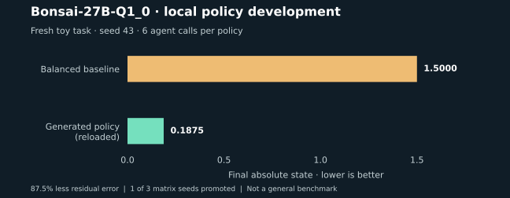

# Bonsai executable-policy experiment — September 22, 2026

Historical matrix. A [later, separately configured follow-up](sandbox-v4-2026-09-22.md)
passed all demonstration gates and repaired the replay stopping issue described below.
These original results and artifacts are preserved unchanged.

**A real local model wrote, repaired and deployed a useful executable policy.**
On the selected fresh toy task, the reloaded policy reduced residual error by 87.5%
at the same six discovery-agent calls. This demonstrates SDK mechanics, not the
published Dream-RSI benchmarks or general improvement across AI architectures.



## Model and setup

| Setting | Value |
| --- | --- |
| Policy developer | [Bonsai-27B-Q1_0](https://huggingface.co/prism-ml/Bonsai-27B-gguf) |
| Backend | Local llama.cpp, `b10107-c0bc8591e` |
| Model file | 3,803,452,480 bytes; SHA-256 in the manifest |
| Hardware | NVIDIA RTX 4070 12 GB; 32 GB system RAM; Windows |
| Server | Context 16,384 tokens; reasoning enabled, budget 1,024; one slot |
| Sampling | Temperature 0.7; top-p 0.95; top-k 20; max output 4,096 tokens |
| Developer | Four source revisions per seed; 240-second request timeout |
| Discovery agent | Fixed deterministic `state / 2` |
| Evaluator | Fixed `-abs(observation)`; higher is better |
| Training / validation / fresh online | Initial states 8 / 6, 10, 14 / 12 |
| Online budget | Six agent calls per run |
| Matrix seeds | 7, 19, 43, declared before the matrix |

Bonsai generates the **policy**, not the toy agent's answers. Generated programs were
not manually edited. The validation tasks are scaled instances of the same toy problem;
they are separate worlds, but do not establish semantic generalization.

## Complete matrix

| Seed | Scored revisions | Promoted and reloaded | Main limitation | Model tokens |
| --- | ---: | --- | --- | ---: |
| 7 | 3/4 | No | Generator-expression rejection, then weak policies | 36,228 |
| 19 | 2/4 | No | Unsupported list sorting, then weak policies | 37,955 |
| 43 | 2/4 | Yes | Successful revisions had identical replay decisions | 33,905 |
| **Total** | **7/12** | **1/3** | Full diversity gate unmet | **108,088** |

Token totals include input and output across 12 local model requests. Zero reported
USD is not a claim of zero hardware or electricity cost. Failed or unscored revisions
are included in the denominator, and are never assigned a successful score.

### What happened in seed 43

1. Bonsai generated a score-prioritizing policy with a non-finite sentinel. The interpreter
   rejected it and returned the source error to the model.
2. The next revision replaced that sentinel with a finite value. The generated policy
   prioritized the best revealed leaf and scored **-1.029985**, versus **-1.05** for
   the incumbent on training replay.
3. The selected candidate passed the three-world held-out comparison:
   **-1.279985** versus **-1.3** for the incumbent.
4. The policy was serialized to JSON, reloaded with its source hash preserved, and run
   on a fresh task. The baseline reached **1.5** residual; the generated policy reached
   **0.1875**, with six agent calls each.

The improvement is in final task quality: **8 times smaller residual**, not 8 times
faster execution. Training replay used three probes rather than six but reached the
**1,000-round cap**. Stopping behavior remains a weakness; probe savings alone would
misrepresent total computation.

The two scored revisions in seed 43 had the same executable structure and replay
decisions. Consequently, the example's stricter demonstration criteria did **not**
all pass, and its exit status was 1. Promotion/reload success and full demonstration
acceptance are different fields in the evidence.

## Separate source-incumbent follow-up

After the matrix, a seed-7 follow-up started from handwritten source equivalent to
BalancedPolicy, allowing the developer to see the baseline program. The interpreter
had also gained bounded generator expressions and list sorting. This is a separate
configuration, **not a fourth matrix seed**.

Three of four revisions scored; the candidate was promoted, saved, reloaded and reached
the same 0.1875 residual at six calls. Successful revisions had different ASTs but
identical replay decisions, so this run also failed the full diversity gate. A failed
revision comparing an integer with `None` remains in the raw report.

## Evidence and reproduction

- [Manifest: settings, usage, acceptance and uncompressed report hashes](bonsai-2026-09-22/manifest.json)
- [Selected portable policy artifact, including original source and ancestry](bonsai-2026-09-22/selected-policy.json)
- Raw JSON reports (gzip): [seed 7](bonsai-2026-09-22/bonsai-matrix-seed-7.json.gz),
  [seed 19](bonsai-2026-09-22/bonsai-matrix-seed-19.json.gz),
  [seed 43](bonsai-2026-09-22/bonsai-matrix-seed-43.json.gz),
  [source-incumbent follow-up](bonsai-2026-09-22/bonsai-source-incumbent-seed-7.json.gz).
- [Chart generator](plot_bonsai.py), reading the archived seed-43 report.

Reports preserve model requests/responses, revision status, source, replay evidence,
usage and deployment results. Historical matrix reports captured implementation hashes
at export time while recovery/export work was ongoing; they are exploratory integration
evidence, not a frozen scientific benchmark. The current example captures hashes at
experiment start. Re-running newer interpreter code can change which revisions succeed.

Start your existing local server with the model, then run:

```bash
python examples/05_local_llamacpp.py --url http://127.0.0.1:8087 --model Bonsai-27B-Q1_0 --revisions 4 --max-tokens 4096 --timeout 240 --seed 43 --output temp/bonsai-reproduction.json
```

Repeat with seeds 7 and 19 to examine the whole matrix. Add `--source-incumbent` for
the separate follow-up configuration. Backend version, hardware and sampling can affect
outputs; seeds do not guarantee bit-identical generations across machines.

For the figure only, install matplotlib in your development environment and run
`python docs/experiments/plot_bonsai.py`. It is not a dependency of the SDK.

Next acceptance targets are reliable boundary stopping, behaviorally distinct successful
rewrites, multi-seed gains on harder tasks, and independently designed held-out datasets.
