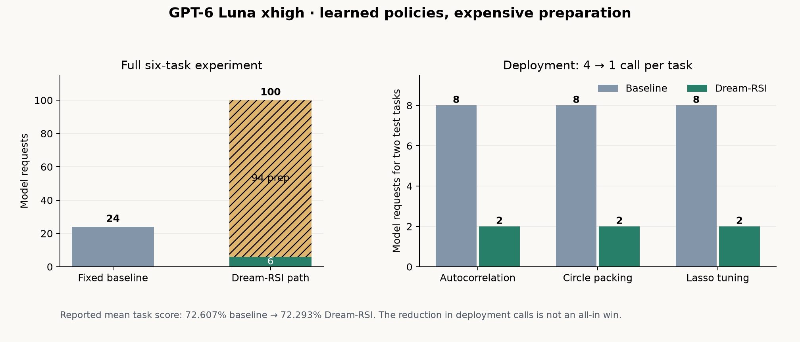

# GPT-6 Luna xhigh: learned exploration policies on three task families

This exploratory run used `gpt-6-luna` with `xhigh` reasoning and the Fast tier
through Codex App Server. The same model generated task candidates and wrote
executable exploration-policy code. The SDK replayed recorded search trees,
validated candidates on separate tasks, and applied the selected policies to
two held-out tasks in each of three families. It did not update model weights.

Training seeds were 11 and 17, validation seeds were 53, 59, 61 and 67, and
test seeds were 101 and 107 in each family. Every test task allowed the fixed
policy four model calls. The saved result is an exploratory v1 comparison;
model generation was stochastic and was not controlled by those task seeds.

| Task family | Training + validation | Policy development | Test calls, baseline → Dream-RSI | Mean reported test score, baseline → Dream-RSI |
| :--- | ---: | ---: | ---: | ---: |
| Low autocorrelation | 23 | 8 | 8 → **2** | 33.333% → 33.333% |
| Circle packing | 23 | 8 | 8 → **2** | 85.496% → 85.496% |
| Lasso tuning | 24 | 8 | 8 → **2** | 98.992% → 98.050% |
| **All three** | **70** | **24** | **24 → 6** | **72.607% → 72.293%** |

Each **2** means one model answer on each of the category's two test tasks,
compared with four answers per task for the fixed policy. The SDK promoted a
policy in every category. In the saved developer histories, the final selected
source first appears at entries 2, 1 and 3 respectively; eight developer
requests were nevertheless charged to each category over the complete run.

Preparation cost **94 model requests**: 70 for training and validation, plus
24 for policy development. Deployment cost another six. The full Dream-RSI
path therefore used **100 requests versus 24 for baseline**. The reported
mean task score was also **0.314 percentage points lower**, principally from
Lasso. Lasso's v1 score includes a penalty for solver update count, so it is
not a standalone measure of mathematical accuracy. The experiment proves that
the SDK can learn and reuse policies that sharply reduce *deployment* calls;
it does **not** prove an all-in cost or quality win.

At the observed six-task deployment saving of 18 calls, amortizing 94 calls of
preparation would require at least six comparable six-task batches **if** the
policies retained their quality and call counts. That transfer was not tested
here. Token, credit and dollar totals were not available from this benchmark;
no zero-cost assumption is made for them.

The [published summary](luna-xhigh-discovery-v1.json) contains the plotted
counts and per-family scores. It was derived from a completed local report;
raw model responses and unrelated local experiment reports are not included.
