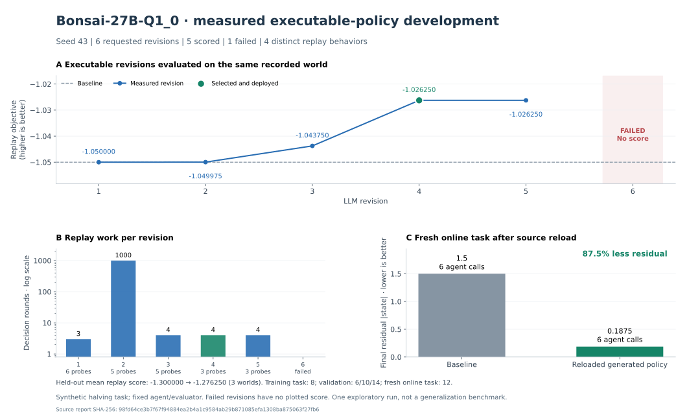

# Executable policy revision and stopping repair — September 22, 2026

**The latest Bonsai-27B-Q1_0 run passed all five demonstration gates:** multiple
scored revisions, different executable structures, different replay decisions,
held-out promotion and execution after saving/reloading the selected source.



The graph reads the archived JSON and verifies its SHA-256. Failed revision 6 has
no fabricated score. Revision numbers below are one-based; raw reports use zero-based indices.

| Revision | Status | Replay objective ↑ | Probes | Rounds | Empty rounds |
| --- | --- | ---: | ---: | ---: | ---: |
| 1 | Scored | -1.050000 | 6 | 3 | 0 |
| 2 | Scored | -1.049975 | 5 | 1000 | 997 |
| 3 | Scored | -1.043750 | 5 | 4 | 1 |
| **4** | **Selected** | **-1.026250** | **3** | **4** | **1** |
| 5 | Scored | -1.026250 | 3 | 4 | 1 |
| 6 | Failed | — | — | — | — |

After feedback about empty rounds, the model rewrote stopping logic in revision 3.
Revision 4 also changed branch selection. No generated source was manually edited.
The discovery agent remained `state / 2`, and evaluation remained `-abs(observation)`.
The selected policy's held-out objective was **-1.27625**, versus **-1.3** for the
baseline, across initial states 6, 10 and 14. Training started at 8.

On a fresh initial state of 12, the baseline reached residual **1.5**, while the
saved/reloaded policy reached **0.1875**, both with **six agent calls**. That is 87.5%
less residual error on this toy task. It is neither an 8× speedup nor evidence of
generalization to arbitrary agents. Scaled versions of one task are limited holdout evidence.

## Configuration and exploratory history

The final follow-up used seed **43**, six revisions, a handwritten source incumbent
equivalent to BalancedPolicy, max output **8,192** tokens, a **300-second** request timeout,
and a server reasoning budget of **4,096** within a **16,384-token** context.
Temperature was 0.7, top-p 0.95 and top-k 20. The model file, local llama.cpp version
and hardware were the same as in the [earlier matrix](bonsai-2026-09-22.md).
Policies ran in the inline `dreamrsi-policy-v4` interpreter. The optional process backend
was verified separately by regression tests, not used for this model experiment.

This is a follow-up after inspecting prior failures, not a preregistered replication:
the feedback contract and reasoning budget changed. All three additional exploratory
runs are preserved in the [manifest](sandbox-v4-2026-09-22/manifest.json):

| Follow-up | Scored | Promoted/reloaded | All demonstration gates |
| --- | ---: | --- | --- |
| Source incumbent, seed 19, reasoning 1024 | 5/6 | No | No |
| v4 round feedback, seed 43, reasoning 1024 | 5/6 | Yes | No: repeated replay decisions |
| v4 boundary feedback, seed 43, reasoning 4096 | 5/6 | Yes | **Yes** |

These follow-ups must not be pooled with the original three-seed matrix into a single
controlled success rate. Repeated use of the toy validation inputs during development
also prevents treating them as an untouched final research test set.

## Reproduce and inspect

With the existing local server configured as above:

```bash
python examples/05_local_llamacpp.py --url http://127.0.0.1:8087 --model Bonsai-27B-Q1_0 --source-incumbent --revisions 6 --max-tokens 8192 --timeout 300 --seed 43 --output temp/bonsai-v4-reproduction.json
```

Raw compressed JSON reports and their hashes are listed in the
[manifest](sandbox-v4-2026-09-22/manifest.json). They include the final failed source,
usage, full generated programs, model requests, replay feedback and acceptance flags.
The [chart script](plot_policy_development.py) regenerates SVG, PNG and
[chart data](../../assets/bonsai-development-v4.json) directly from this evidence.
Model sampling and backend differences can change results on rerun.

The remaining research work is broader multi-seed evaluation on harder tasks, new
independent validation datasets, and measuring full development plus online costs.
