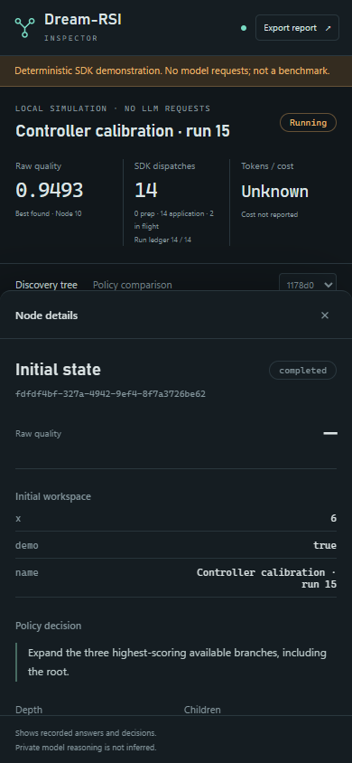

# Live Inspector

Watch an actual Dream-RSI execution in your browser: active branches, recorded
answers, policy decisions and the call ledger. Everything runs on your computer.
The viewer needs no account, hosting, Node.js, CDN or additional Python dependency.

**Available in 0.3.0b2.** Install the Beta and open the demonstration:

```bash
python -m pip install --pre --upgrade dreamrsi==0.3.0b2
python -m dreamrsi watch --demo
```

The browser opens automatically. `--demo` runs a deterministic local SDK example
with animated, genuinely dispatched adapter attempts. It uses no LLM and is not
a model benchmark. Its journal is separate from your application journal.


Screenshots in this guide show the deterministic local demonstration, not a
real-model quality or cost benchmark.

## Connect your application

Add an inspector to your existing runtime; keep your agent, evaluator, policy
and budgets:

```python
from dreamrsi import DreamRSI, LiveInspector

with LiveInspector() as inspector:
    sdk = DreamRSI(
        agent=my_agent,
        evaluator=my_evaluator,
        policy=my_policy,
        budget=my_budget,
        inspector=inspector,
    )
    result = await sdk.run(task)
    print(result.report())
```

In a second terminal, from the same project directory:

```bash
python -m dreamrsi watch
```

The viewer can start before your application. Its waiting screen explains how
to connect. The context manager flushes pending journal writes on exit. The
inspector does not supply persistent policy memory: keep using your configured
`SQLiteStore` or imported bundles for reusable trees and policies.

For a complete runnable example generated into a new file:

```bash
python -m dreamrsi init
python dreamrsi_app.py
```

`init` refuses to overwrite an existing file. Replace the example's agent and
evaluator with your integration when ready. `dreamrsi doctor` checks Python,
bundled UI files and the selected inspector journal without making model calls.
`dreamrsi inspect path/to/bundle.dreamrsi.json` checks a saved bundle's integrity
and codecs; it does not establish quality on your tasks.

## Read the tree

- **Amber:** an attempt is actually in flight. Moving marks follow its ancestor
  path. If it finishes before its parallel batch is revealed, the node says
  **Awaiting batch**. Historical playback does not pretend a request is live.
- **Mint:** the best valid answer found so far and its recorded path.
- **Red:** a recorded failure. Skipped work has a dashed outline.
- **Node details:** recorded answer, quality, policy decision, supplied reason,
  diagnostics and elapsed attempt time when it can be matched unambiguously.

Drag to pan; use the zoom controls or mouse wheel. **Fit tree** shows the whole
visible tree. **Follow active** keeps current work readable. The small control
on a parent collapses or expands its descendants. Select a run in the left rail
or the mobile selector. Keyboard users can tab through nodes and select with
Enter; `+`, `-` and `0` control the focused graph. Escape closes node details.
The interface respects your browser's reduced-motion preference.

<details>
<summary>Mobile interface</summary>



</details>

Use the timeline to inspect an earlier event or play recorded history. **Go
live** returns to the latest event. None of these controls repeat model calls.
If the writer stops before a run closes, the viewer pauses movement and marks
the final outcome unknown.

A policy may return `PolicyDecision(..., reason="why this branch was chosen")`.
Reasons are optional recorded explanations. The viewer never infers a model's
private reasoning or fabricates a reason for an existing policy.

## Read costs and quality

With a `QualityContract`, the main quality value is measured raw quality.
Otherwise it is the evaluator score. **Best found** is evidence about this run,
not a claim that it beats a baseline or generalizes to unseen tasks.

The call ledger includes this runtime's settled agent/developer calls, reported
nested provider calls, in-flight reservations and historical preparation declared
in `EconomyPlan`. Preparation and application remain separate. The run ledger
shows settled and reserved calls against its configured cap. A deterministic
adapter still consumes SDK dispatch slots; the demo labels these explicitly.

Token and dollar totals are shown only when relevant reported usage is complete
enough to display; otherwise they stay **Unknown**. Historical preparation with
unreported tokens or dollars also makes those totals unknown. Reporting external
agent/evaluator requests remains the integration's responsibility. The viewer
cannot discover unreported provider work or establish all-in ROI without a
matching baseline and quality comparison. `result.report()` describes one run
and labels that scope explicitly.

## Compare policies offline

Record a comparison through the SDK, then open **Policy comparison**:

```python
from dreamrsi.policies import BreadthFirstPolicy, GreedyPolicy
from dreamrsi.replay import ReplayWorld

reports = await inspector.compare(
    sdk,
    ReplayWorld(result.tree),
    [BreadthFirstPolicy(batch_size=1), GreedyPolicy(batch_size=1)],
)
inspector.flush()
```

This uses the runtime's configured replay engine and never promotes a policy.
The default `StrictReplay` reveals recorded outcomes without dispatching the
agent or evaluator. Custom replay engines, policy code and quality callbacks
retain their own behavior; the inspector cannot guarantee that arbitrary user
components make no external requests.

**Unrecorded continuations** are missing evidence, not failed answers. **Show
recorded path** overlays the outcomes actually revealed by that replay. If your
quality contract preserves the original policy, replay honors it and displays
the effective policy alongside the requested one. This comparison is finite
replay evidence, not independent validation.


## Save a report

Click **Export report**, or run:

```bash
python -m dreamrsi watch --export dreamrsi-report.html
```

The result is one self-contained HTML file with the selected run's visible
history, styles and viewer. Open it offline or share it after reviewing its
contents. CLI export refuses to overwrite a file. Browser export follows your
browser's download behavior. The HTML is a report, not an executable policy
bundle or a replacement for `dreamrsi save`.

## Local data and limits

The default journal is `.dreamrsi/inspector.sqlite3`. Change it on both sides:

```python
with LiveInspector("logs/search.sqlite3", include_content=False) as inspector:
    ...
```

```bash
python -m dreamrsi watch --journal logs/search.sqlite3 --port 8765
```

`include_content=False` omits task, answer, state, source and metadata content
while retaining structural events and measured quality. With content enabled,
the journal can contain private application data. Common credential patterns
are redacted, but redaction is not a guarantee that arbitrary text is safe to
share. Review exported reports. The inspector adds SQLite ignore rules when it
creates a new `.dreamrsi/.gitignore`; preserve or extend an existing ignore file.
Capture accepts plain JSON values. Other objects and subclasses appear as
unsupported markers; their custom serializers are not executed. Long or deeply
nested content is bounded, and capture-limit warnings identify incomplete data.

The server binds only to `127.0.0.1`; `--no-browser` prints its local URL without
opening a tab. There are no mutation or execution endpoints in the viewer.
Observation uses a separate bounded queue and background SQLite writer. Queue
overflow and display truncation are visible. The default queue holds 4,096
events; `LiveInspector(queue_capacity=8192)` changes it. The run rail lists the
latest 40 runs, the timeline retains up to 10,000 events per snapshot, and the
graph renders up to 400 nodes at a time with depth capped at 40. Larger trees
remain in the journal; collapse branches to explore their visible descendants.
The viewer polls once per second rather than tracing model-token streaming.

Observation adds CPU and disk overhead, though it makes no model requests and
does not steer search decisions. Tests compare answers, policy decisions,
callback invocation counts and costs with and without observation. Extremely
tight wall-clock limits can still make any instrumentation change timing.
Disable it by omitting `inspector=`. Stop the viewer with Ctrl+C; stopping the
viewer does not cancel an application running in another process.
