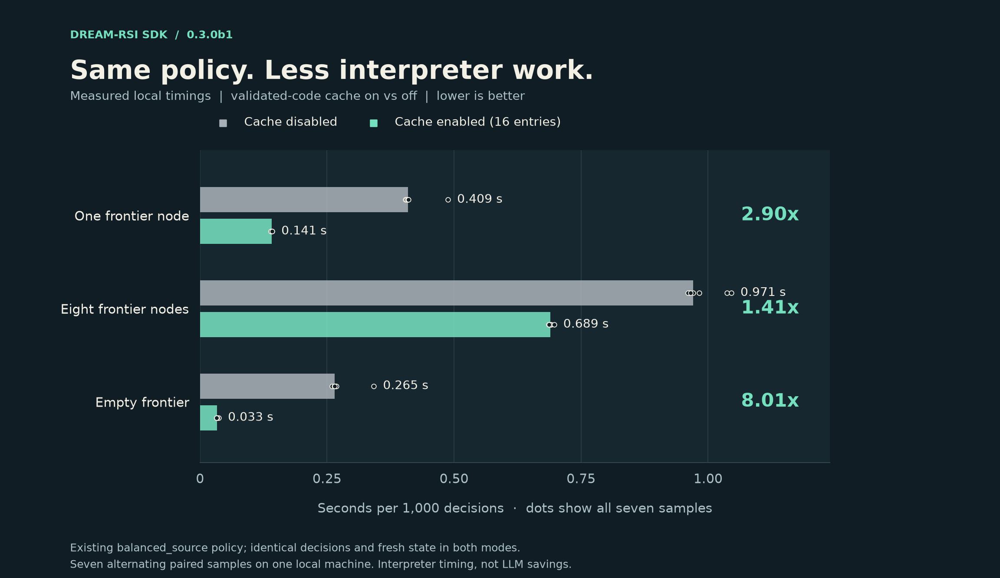

# Policy sandbox configuration

The SDK supplies its own bounded AST interpreter. Generated policies can write new
ranking, branching, batching and stopping logic; they are not restricted to built-in
strategy templates. The interpreter accepts a Python syntax subset, not arbitrary
Python programs. `PolicySandbox.capabilities()` describes the active profile sent to
the policy developer.

## Start with one line

```python
from dreamrsi import PolicySandbox, ProcessPolicySandbox, SandboxConfig

sandbox = PolicySandbox.from_preset("balanced")
# Give larger programs more resources without enabling host access:
worker = ProcessPolicySandbox.from_preset("large", max_steps=2_000_000)
```

`small`, `balanced` and `large` choose finite resource limits. Every preset enables
all implemented language features: helpers, comprehensions, collection methods and
the pure math proxy. `balanced` is exactly the existing default, so this release does
not silently tighten old programs. Presets can be overridden per limit or allowlist.

| Resource | `small` | `balanced` | `large` |
| --- | ---: | ---: | ---: |
| Interpreter steps | 10,000 | 100,000 | 1,000,000 |
| Items per value | 2,000 | 20,000 | 100,000 |
| Cumulative value units | 200,000 | 2,000,000 | 20,000,000 |
| Source bytes | 32,768 | 131,072 | 1,048,576 |
| AST nodes | 4,000 | 16,000 | 64,000 |
| Value depth | 32 | 48 | 64 |
| Integer bits | 256 | 512 | 1,024 |
| Call depth | 16 | 32 | 64 |

## Save and reuse configuration

```python
SandboxConfig.preset("large", max_steps=2_000_000).save("sandbox.json")
sandbox = PolicySandbox.from_file("sandbox.json")
# The same profile also works with the killable worker:
worker = ProcessPolicySandbox.from_file("sandbox.json", max_steps=3_000_000)
```

`save()` returns the absolute path and refuses an existing file unless you explicitly
pass `overwrite=True`. `SandboxConfig.load(path)`, `to_json()` and `from_json(text)`
also work directly. Unknown fields, unsupported function names and invalid limits
fail during profile loading. JSON stores the effective limits, rather than a preset
name whose defaults might change. These are host-side configuration APIs; generated
policy code cannot read or write files.

## Configure individual permissions

```python
from dreamrsi import PolicySandbox, SandboxConfig

profile = SandboxConfig(
    max_steps=200_000,
    max_items=40_000,
    allow_helpers=True,
    allow_comprehensions=True,
    allow_methods=True,
    allow_math=True,
    # None enables all supported functions in the category.
    # An empty tuple disables every function in that category.
    allowed_builtins=("len", "min", "max", "sum", "sorted", "range", "abs"),
    allowed_math=("sqrt", "log", "pi"),
    allowed_methods=("dict.get", "dict.items", "list.append", "list.sort"),
)
sandbox = PolicySandbox(profile)
# Keyword overrides also work: PolicySandbox(profile, max_steps=300_000).
```

The broad feature switches take precedence over the name lists: `allow_math=False`
disables every math operation even when `allowed_math` contains names. Unsupported
names are rejected when constructing the configuration. The lists only narrow the
implemented language; they cannot enable host functions such as `open` or `eval`.
Profiles are immutable dataclasses. Construct a new profile or use dataclass `replace`
to change one. `SandboxConfig.to_dict()` and `from_dict()` round-trip through JSON.

| Limit | Default | Meaning |
| --- | ---: | --- |
| `max_source_bytes` | 131,072 | UTF-8 source size |
| `max_ast_nodes` | 16,000 | Parsed syntax tree size |
| `max_steps` | 100,000 | Interpreter operations per decision |
| `max_items` | 20,000 | Items/characters in one value |
| `max_units` | 2,000,000 | Cumulative checked value units |
| `max_value_depth` | 48 | Nested value depth |
| `max_integer_bits` | 512 | Integer magnitude |
| `max_call_depth` | 32 | Nested helper/recursive calls |

All limits must be positive integers. Floats must be finite. The execution deadline
is supplied separately as `SourcePolicy(..., timeout_s=5)` or
`await sandbox.execute(source, view, timeout_s=5)`. Logical allocation units are not
a byte count, RSS measurement or OS memory quota.

For automatically generated candidates, set `DeveloperConfig(policy_timeout_s=5)`.
This decision deadline is independent of `model_timeout_s`, which limits the model
request. The policy deadline survives source-policy serialization and developer resume.

## Repeated replay without repeated parsing

Inline `PolicySandbox` caches up to **16 validated syntax trees** by exact source and
immutable configuration. Every decision still creates a fresh interpreter, copies
the JSON view, and applies the original operation, value and time limits. The cache
contains no observations, decisions, module variables or policy state. Public
`parse()` returns an independent tree, so changing it cannot alter cached execution.
Malformed source is never cached, and a source/profile change is validated again.

```python
sandbox = PolicySandbox.from_preset("balanced", cache_size=32)
print(sandbox.cache_info())  # capacity, entries, hits, misses
sandbox.clear_cache()
# Disable it for comparisons or extremely memory-constrained applications:
uncached = PolicySandbox(cache_size=0)
```

Capacity is an entry count, not an RSS quota; retained source and AST sizes are also
bounded by the configured source and AST limits. Cache settings do not change the
language profile or portable policy compatibility.

For `N` uses of unchanged source, let `P` be parsing/validation time and `E` be execution
time. Ignoring cache-lookup overhead and without eviction, the work changes from
`N(P + E)` to `P + NE`: the asymptotic speedup is `1 + P/E`, while the executed policy
and fresh state remain the same.

A local deterministic check on 2026-10-04 used the existing `balanced_source.py`,
seven alternating paired samples of 1,000 decisions, and identical results in both
modes. Median timings per 1,000 decisions:

| View | Cache disabled | Cache enabled | Speedup |
| --- | ---: | ---: | ---: |
| One frontier node | 0.409 s | 0.141 s | **2.90x** |
| Eight frontier nodes | 0.971 s | 0.689 s | **1.41x** |
| Terminal, empty frontier | 0.265 s | 0.033 s | **8.01x** |

These are interpreter timings, not a real-model benchmark, LLM request reduction or
a universal campaign speedup. Larger views spend more time in copying, ranking and
execution, reducing the benefit.



The [verification record](verification/0.3.0b1.md) contains the frozen measurements
and commands for reproducing the figures or measuring your own machine.

## Execution backends

`PolicySandbox` executes in the caller's process. It is the low-overhead default for
frequent replay decisions. Despite its async interface, its interpreter work is
synchronous: other asyncio tasks wait until that decision finishes or its internal
deadline/operation limit fires.

`ProcessPolicySandbox` runs the **same interpreter and profile** in a fresh Python
worker for each decision. It keeps that work off the application's event loop and
kills/reaps the worker on timeout or cancellation. No Docker or extra dependency is
required. Windows workers use a hidden process. Worker startup/import time counts
toward the decision timeout after OS process creation.

```python
from dreamrsi import (
    DeveloperConfig, LLMPolicyDeveloper, PolicyCodec, ProcessPolicySandbox,
)

worker = ProcessPolicySandbox(profile)
developer = LLMPolicyDeveloper(
    generate_source,
    sandbox=worker,
    config=DeveloperConfig(response_format="python", policy_timeout_s=5),
)
# For durable source-policy recovery, use the same backend/profile:
# DreamRSI(..., policy_optimizer=developer, policy_codec=PolicyCodec(worker))
```

Process startup per decision is expensive for large replay pools. Choose it for
interruptibility and application responsiveness, not an assumed speedup. It is not
an OS filesystem/network sandbox and does not install OS memory quotas. Host access
is still excluded by the interpreter's allowlist. Arbitrary Python, host imports,
files, sockets and subprocess creation remain unavailable to generated code in both
backends. Trusted handwritten policies and agent callbacks are separate application code.
The process backend intentionally starts a fresh worker each time, so its parent-side
AST cache does not remove worker startup or provide the inline speedup above.

## Language and observations

Policies define `def decide(view)` and return a dictionary containing `expand`, with
optional `stop` and `parallelism`. The view and node summaries are dictionaries.
Helpers can be module-level or local and capture local values. Supported constructs
include loops, conditionals, list/dictionary comprehensions, bounded generator-expression
syntax, sorting keys and `list.sort`, arithmetic, and the restricted math proxy.
Generator expressions are evaluated eagerly into bounded lists; they are not lazy
Python generator objects. Collections use interpreter value-copy semantics, not full
Python object identity/aliasing semantics. No persistent module state survives a decision.

`view['history']` contains revealed nodes. `view['last_round']` is initially `None`,
then contains the previous executed batch, revealed node IDs, and best score before
and after it. Online and replay supply this causal field. An empty replay continuation
is visible only after the attempted round; future children remain hidden. This allows
model-written policies to reason about stalled progress without external mutable state.

## Loading artifacts and verification

The current language profile is `dreamrsi-policy-v4`. PolicyCodec compares saved and
active capabilities, including execution backend and allowlists. A changed profile
is not silently accepted. Historical v3 reports remain historical evidence. To migrate
their source explicitly, verify its `PolicyArtifact` hash, create a new `SourcePolicy`
with the chosen current sandbox, and rerun validation before deployment; do not edit
the archived report to pretend it used the new profile.

Regression tests cover profile enforcement, JSON round trips, source/profile integrity,
equivalent worker results, event-loop responsiveness, timeout termination and cancellation
cleanup. These process checks were executed on Windows in the local development environment;
Linux CI remains a separate check. This is a bounded interpreter with regression coverage,
not a formally verified security boundary for hostile arbitrary Python.
