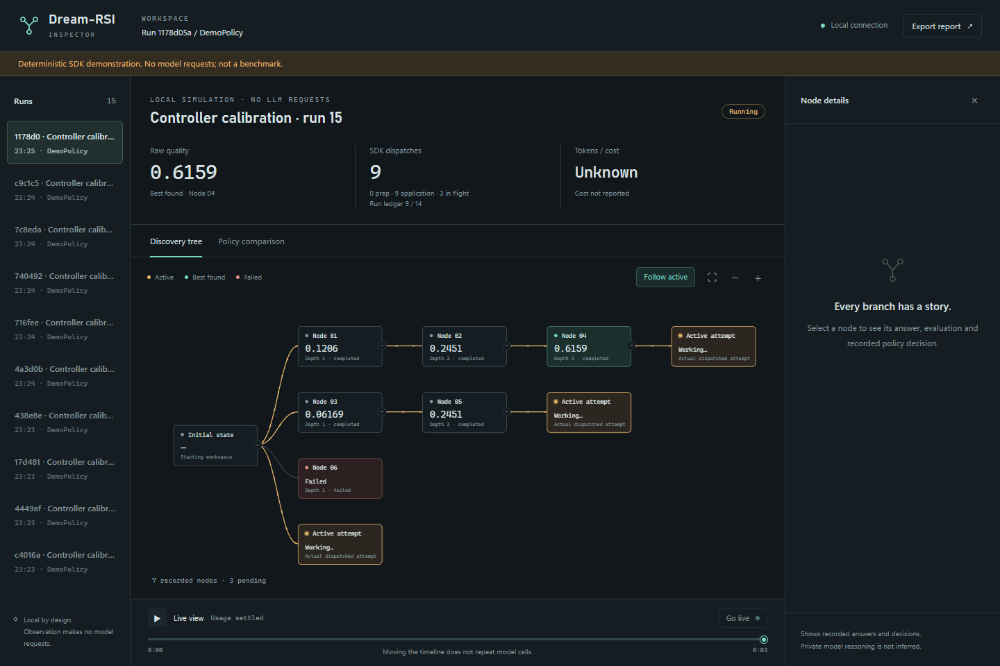
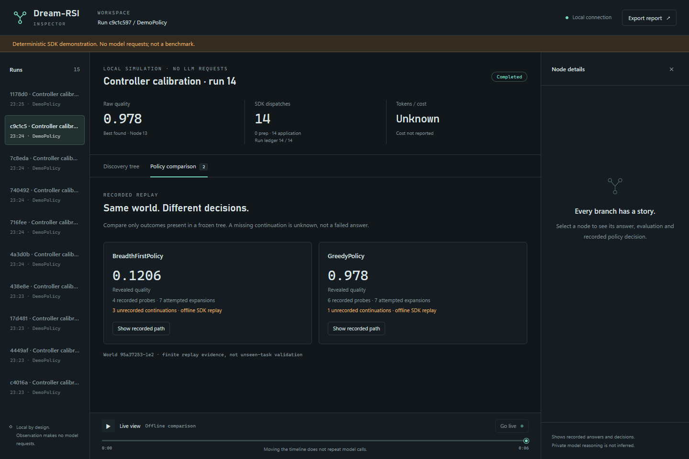

# 0.3.0b2 verification

Verified on October 8, 2026. This is engineering verification of the Live
Inspector and SDK integration, not an LLM performance or all-in ROI benchmark.
No model requests were dispatched by these checks.

| Gate | Evidence |
| --- | --- |
| Release test set, Windows / Python 3.14.6 | 647 passed, no failures or skips |
| Static checks | Ruff and Pyright passed; no whitespace errors |
| Distribution | Source archive and wheel built; `twine check --strict` passed |
| Installed package, Windows / Python 3.11.15 | Isolated import, recursive codecs, quality/economy, process worker, Inspector HTTP assets and CLI smoke checks |
| Starter workflow from installed wheel | `init` → generated application → `doctor` → standalone HTML export |
| Shared bundle inspection | Synthetic one-family, one-policy, one-tree bundle accepted; altered checksum rejected |
| Chromium interface | 11 scenarios passed, no JavaScript errors; production Content Security Policy also checked |
| Archive contents | Viewer assets included, no mandatory dependencies; private experiments, marketing, temporary files and PowerShell launchers excluded |

The 647-test release set includes 16 focused Inspector cases. The larger local
workspace suite also passed 731 tests; its additional private benchmark-script
regressions are not shipped or counted as release tests.

## Browser coverage

- Active branches reflect actual dispatched adapter work and animate while live.
- Node details, history rewind and return to live mode work without rerunning tasks.
- Policy comparison and path overlays display recorded evidence and missing continuations.
- Collapse, zoom and mobile layouts remain usable without horizontal overflow.
- Reduced-motion preference disables active-path animation.
- Standalone HTML works offline and contains only the selected run.

These screenshots come from the working browser interface and its local deterministic
demo. They contain no real user tasks, model responses, credentials or benchmark data.
The UI assets and search instrumentation are unchanged from that browser check;
release preparation updated version metadata and documentation.

## Runtime and compatibility coverage

Observer tests compare returned answers, full tree shapes, recorded decisions,
callback invocation counts and costs with and without observation for serial and
parallel execution. They also check failed attempts, budget reservations, bounded
capture, credential redaction, unsupported custom objects, server access boundaries,
selected-run export, and safe starter-file creation.

Omitting `inspector=` keeps the previous integration. Instrumentation makes no model
requests, but adds CPU and disk work; these tests cannot establish identical outcomes
under arbitrarily tight wall-clock limits. Reports cannot infer unreported external
API usage. Policy reasons are supplied explanations, not inferred private reasoning.

Minimum-version installation and wheel checks ran outside the source checkout.
Remote Linux/Windows and Python-matrix results belong to the exact release commit:
see [GitHub Actions](https://github.com/TheAstrayDev/dream-rsi-sdk/actions).

[Inspector guide](../inspector.md) · [Release notes](../releases/0.3.0b2.md)
